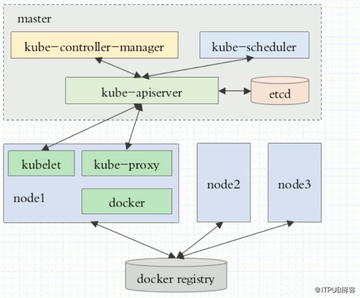
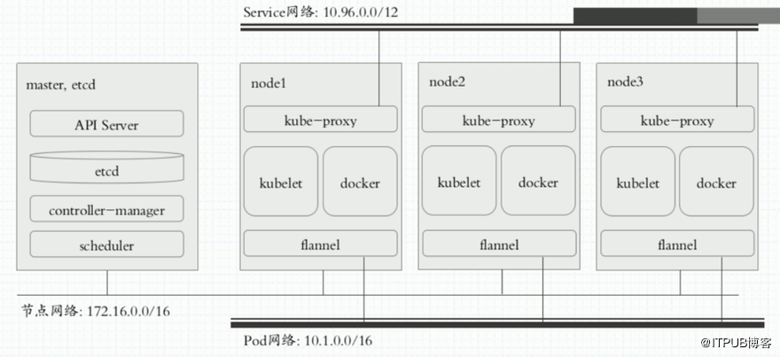

# k8s集群安装
> 文章来源：https://www.jianshu.com/p/67a3bf4458e8
## 一、集群架构图






## 二、相关概念

**Cluster：**计算、存储、网络资源的总和。Kubernetes的各种基于容器的应用都是运行在这些资源上的。

**Master：**Kubernetes的大脑，负责调度各种计算资源。Master可以是物理机或虚拟机，多个Master可以同时运行，并实现HA。Master节点上运行的组件可以参见本文架构图。

**Node：**负责运行容器的应用，由Master管理，可以是物理机或虚拟机。

**Pod：**Kubernetes的最小工作单元，也就是说Kubernetes管理的是Pod而不是容器。每个Pod包括一个或多个容器。Pod中的容器会被作为一个整体被Master调度到另一个Node上。

**Controller：**Kubernetes通常不会直接创建Pod，而是通过Controller来管理Pod的。Controller中定义了容器中的一些部署特性。

**Service：**外界访问一组特定的Pod方式，有自己的IP和端口，Service为Pod提供了负载均衡。

**Namespace：**Namespace可以将一个物理的Cluster逻辑上划分为多个虚拟Cluster，每个Cluster就是一个Namespace，不同的Namespace里的资源完全是隔离的。创建资源时，如果不指定，将会被放到default这个默认的Namespace中。

## 三、安装步骤

*提示：要在每个节点进行以下操作*

### 1.修改主机命名【可操作】


```csharp
[root@k8s-master ~]# vim /etc/hosts

192.168.148.10 k8s-master
192.168.148.11 k8s-node01
192.168.148.12 k8s-node02
```

### 2.关闭并禁用防火墙


```csharp
[root@k8s-master ~]# systemctl stop firewalld
[root@k8s-master ~]# systemctl disable firewalld
```

### 3.网络桥接设置


```tsx
[root@k8s-master ~]# echo 'net.bridge.bridge-nf-call-iptables = 1'>>/etc/sysctl.conf
[root@k8s-master ~]# echo 'net.bridge.bridge-nf-call-ip6tables = 1'>>/etc/sysctl.conf

[root@k8s-master ~]# sysctl -p
net.bridge.bridge-nf-call-iptables = 1
net.bridge.bridge-nf-call-ip6tables = 1
```

### 4.准备yum源

> 参考 https://developer.aliyun.com/mirror/docker-ce

```csharp
[root@k8s-master ~]# cd /etc/yum.repos.d/

# docker源
[root@k8s-master ~]# wget https://mirrors.aliyun.com/docker-ce/linux/centos/docker-ce.repo

# k8s源
[root@k8s-master yum.repos.d]# vim k8s.repo
[k8s]
name=k8s repo
baseurl=https://mirrors.aliyun.com/kubernetes/yum/repos/kubernetes-el7-x86_64/
gpgcheck=1
gpgkey=https://mirrors.aliyun.com/kubernetes/yum/doc/yum-key.gpg
enabled=1
# 保存退出

[root@k8s-master yum.repos.d]# yum repolist
[root@k8s-master yum.repos.d]# wget https://mirrors.aliyun.com/kubernetes/yum/doc/yum-key.gpg 
[root@k8s-master yum.repos.d]# rpm --import yum-key.gpg
[root@k8s-master yum.repos.d]# wget https://mirrors.aliyun.com/kubernetes/yum/doc/rpm-package-key.gpg
[root@k8s-master yum.repos.d]# rpm --import rpm-package-key.gpg
```

### 5.查看安装版本列表

```css
[root@k8s-master yum.repos.d]# yum list docker-ce --showduplicates
已加载插件：fastestmirror
Loading mirror speeds from cached hostfile
 * base: centos.ustc.edu.cn
 * extras: centos.ustc.edu.cn
 * updates: centos.ustc.edu.cn
已安装的软件包
docker-ce.x86_64    18.06.0.ce-3.el7           @docker-ce-stable
可安装的软件包
docker-ce.x86_64    17.03.0.ce-1.el7.centos    docker-ce-stable 
docker-ce.x86_64    17.03.1.ce-1.el7.centos    docker-ce-stable 
docker-ce.x86_64    17.03.2.ce-1.el7.centos    docker-ce-stable 
docker-ce.x86_64    17.03.3.ce-1.el7           docker-ce-stable 
docker-ce.x86_64    17.06.0.ce-1.el7.centos    docker-ce-stable 
docker-ce.x86_64    17.06.1.ce-1.el7.centos    docker-ce-stable 
docker-ce.x86_64    17.06.2.ce-1.el7.centos    docker-ce-stable 
docker-ce.x86_64    17.09.0.ce-1.el7.centos    docker-ce-stable 
docker-ce.x86_64    17.09.1.ce-1.el7.centos    docker-ce-stable 
docker-ce.x86_64    17.12.0.ce-1.el7.centos    docker-ce-stable 
docker-ce.x86_64    17.12.1.ce-1.el7.centos    docker-ce-stable 
docker-ce.x86_64    18.03.0.ce-1.el7.centos    docker-ce-stable 
docker-ce.x86_64    18.03.1.ce-1.el7.centos    docker-ce-stable 
docker-ce.x86_64    18.06.0.ce-3.el7           docker-ce-stable 
docker-ce.x86_64    18.06.1.ce-3.el7           docker-ce-stable 
docker-ce.x86_64    3:18.09.0-3.el7            docker-ce-stable 
```

### 6.在mster节点安装软件

> 参考 https://developer.aliyun.com/mirror/kubernetes

这里选择安装docker-ce-18.06，kubelet、 kubeadm、 kubectl 1.12.1版本

```css
yum -y install docker-ce-18.06.0.ce-3.el7 kubelet-1.12.1-0 kubeadm-1.12.1-0 kubectl-1.12.1-0


等待安装完成...
```

```shell
cat <<EOF > /etc/yum.repos.d/kubernetes.repo
[kubernetes]
name=Kubernetes
baseurl=https://mirrors.aliyun.com/kubernetes/yum/repos/kubernetes-el7-x86_64/
enabled=1
gpgcheck=1
repo_gpgcheck=1
gpgkey=https://mirrors.aliyun.com/kubernetes/yum/doc/yum-key.gpg https://mirrors.aliyun.com/kubernetes/yum/doc/rpm-package-key.gpg
EOF
setenforce 0
yum install -y kubelet kubeadm kubectl
systemctl enable kubelet && systemctl start kubelet
```


查看安装清单

```csharp
[root@k8s-master yum.repos.d]# rpm -ql kubelet
/etc/kubernetes/manifests #清单目录
/etc/sysconfig/kubelet #配置文件
/etc/systemd/system/kubelet.service
/usr/bin/kubelet #主程序
```

### 7.k8s相关docker镜像获取

首先需要启动docker程序

```bash
systemctl daemon-reload #修改docker相关配置文件时，需要重新加载配置信息
systemctl start docker  #启动docker程序
systemctl enable docker  #并设置开机自动启动
systemctl enable kubelet  #并设置开机自动启动
```

由于google http://www.ik8s.io:10080 镜像网址无法访问，相关镜像无法下载，可到阿里相关用户公开镜像仓库下载（我已准备好v1.12.1相关版本镜像）：

```csharp
docker pull registry.cn-beijing.aliyuncs.com/yzxd/kube-apiserver:v1.12.1
docker pull registry.cn-beijing.aliyuncs.com/yzxd/kube-controller-manager:v1.12.1
docker pull registry.cn-beijing.aliyuncs.com/yzxd/kube-scheduler:v1.12.1
docker pull registry.cn-beijing.aliyuncs.com/yzxd/kube-proxy:v1.12.1
docker pull registry.cn-beijing.aliyuncs.com/yzxd/etcd:3.2.24
docker pull registry.cn-beijing.aliyuncs.com/yzxd/pause:3.1
docker pull registry.cn-beijing.aliyuncs.com/yzxd/coredns:1.2.2
docker pull registry.cn-beijing.aliyuncs.com/yzxd/flannel:v0.10.0-amd64

# 下载完成后，查看镜像
[root@k8s-master ~]# docker images
REPOSITORY                                                      TAG                 IMAGE ID            CREATED             SIZE
registry.cn-beijing.aliyuncs.com/yzxd/kube-proxy                v1.12.1             61afff57f010        2 months ago        96.6MB
registry.cn-beijing.aliyuncs.com/yzxd/kube-apiserver            v1.12.1             dcb029b5e3ad        2 months ago        194MB
registry.cn-beijing.aliyuncs.com/yzxd/kube-controller-manager   v1.12.1             aa2dd57c7329        2 months ago        164MB
registry.cn-beijing.aliyuncs.com/yzxd/kube-scheduler            v1.12.1             d773ad20fd80        2 months ago        58.3MB
registry.cn-beijing.aliyuncs.com/yzxd/etcd                      3.2.24              3cab8e1b9802        2 months ago        220MB
registry.cn-beijing.aliyuncs.com/yzxd/coredns                   1.2.2               367cdc8433a4        3 months ago        39.2MB
registry.cn-beijing.aliyuncs.com/yzxd/flannel                   v0.10.0-amd64       f0fad859c909        10 months ago       44.6MB
registry.cn-beijing.aliyuncs.com/yzxd/pause                     3.1                 da86e6ba6ca1        11 months ago       742kB

# 由于k8s使用镜像名称与下载的镜像名不同，需要进行镜像名称改动
docker tag registry.cn-beijing.aliyuncs.com/yzxd/pause:3.1 k8s.gcr.io/pause:3.1
docker tag registry.cn-beijing.aliyuncs.com/yzxd/coredns:1.2.2 k8s.gcr.io/coredns:1.2.2
docker tag registry.cn-beijing.aliyuncs.com/yzxd/etcd:3.2.24 k8s.gcr.io/etcd:3.2.24
docker tag registry.cn-beijing.aliyuncs.com/yzxd/kube-scheduler:v1.12.1 k8s.gcr.io/kube-scheduler:v1.12.1
docker tag registry.cn-beijing.aliyuncs.com/yzxd/kube-controller-manager:v1.12.1 k8s.gcr.io/kube-controller-manager:v1.12.1
docker tag registry.cn-beijing.aliyuncs.com/yzxd/kube-apiserver:v1.12.1 k8s.gcr.io/kube-apiserver:v1.12.1
docker tag registry.cn-beijing.aliyuncs.com/yzxd/kube-proxy:v1.12.1 k8s.gcr.io/kube-proxy:v1.12.1
docker tag registry.cn-beijing.aliyuncs.com/yzxd/flannel:v0.10.0-amd64 quay.io/coreos/flannel:v0.10.0-amd64

# 修改后的镜像列表
[root@k8s-master ~]# docker images
REPOSITORY                                                      TAG                 IMAGE ID            CREATED             SIZE
k8s.gcr.io/kube-proxy                                           v1.12.1             61afff57f010        2 months ago        96.6MB
registry.cn-beijing.aliyuncs.com/yzxd/kube-proxy                v1.12.1             61afff57f010        2 months ago        96.6MB
k8s.gcr.io/kube-scheduler                                       v1.12.1             d773ad20fd80        2 months ago        58.3MB
registry.cn-beijing.aliyuncs.com/yzxd/kube-scheduler            v1.12.1             d773ad20fd80        2 months ago        58.3MB
k8s.gcr.io/kube-apiserver                                       v1.12.1             dcb029b5e3ad        2 months ago        194MB
registry.cn-beijing.aliyuncs.com/yzxd/kube-apiserver            v1.12.1             dcb029b5e3ad        2 months ago        194MB
k8s.gcr.io/kube-controller-manager                              v1.12.1             aa2dd57c7329        2 months ago        164MB
registry.cn-beijing.aliyuncs.com/yzxd/kube-controller-manager   v1.12.1             aa2dd57c7329        2 months ago        164MB
k8s.gcr.io/etcd                                                 3.2.24              3cab8e1b9802        2 months ago        220MB
registry.cn-beijing.aliyuncs.com/yzxd/etcd                      3.2.24              3cab8e1b9802        2 months ago        220MB
k8s.gcr.io/coredns                                              1.2.2               367cdc8433a4        3 months ago        39.2MB
registry.cn-beijing.aliyuncs.com/yzxd/coredns                   1.2.2               367cdc8433a4        3 months ago        39.2MB
quay.io/coreos/flannel                                          v0.10.0-amd64       f0fad859c909        10 months ago       44.6MB
registry.cn-beijing.aliyuncs.com/yzxd/flannel                   v0.10.0-amd64       f0fad859c909        10 months ago       44.6MB
k8s.gcr.io/pause                                                3.1                 da86e6ba6ca1        11 months ago       742kB
registry.cn-beijing.aliyuncs.com/yzxd/pause                     3.1                 da86e6ba6ca1        11 months ago       742kB

# 删除下载的镜像
docker rmi registry.cn-beijing.aliyuncs.com/yzxd/kube-apiserver:v1.12.1
docker rmi registry.cn-beijing.aliyuncs.com/yzxd/kube-controller-manager:v1.12.1
docker rmi registry.cn-beijing.aliyuncs.com/yzxd/kube-scheduler:v1.12.1
docker rmi registry.cn-beijing.aliyuncs.com/yzxd/kube-proxy:v1.12.1
docker rmi registry.cn-beijing.aliyuncs.com/yzxd/etcd:3.2.24
docker rmi registry.cn-beijing.aliyuncs.com/yzxd/pause:3.1
docker rmi registry.cn-beijing.aliyuncs.com/yzxd/coredns:1.2.2
docker rmi registry.cn-beijing.aliyuncs.com/yzxd/flannel:v0.10.0-amd64

[root@k8s-master ~]# docker images
REPOSITORY                           TAG                 IMAGE ID            CREATED             SIZE
k8s.gcr.io/kube-proxy                v1.12.1             61afff57f010        2 months ago        96.6MB
k8s.gcr.io/kube-scheduler            v1.12.1             d773ad20fd80        2 months ago        58.3MB
k8s.gcr.io/kube-apiserver            v1.12.1             dcb029b5e3ad        2 months ago        194MB
k8s.gcr.io/kube-controller-manager   v1.12.1             aa2dd57c7329        2 months ago        164MB
k8s.gcr.io/etcd                      3.2.24              3cab8e1b9802        2 months ago        220MB
k8s.gcr.io/coredns                   1.2.2               367cdc8433a4        3 months ago        39.2MB
quay.io/coreos/flannel               v0.10.0-amd64       f0fad859c909        10 months ago       44.6MB
k8s.gcr.io/pause                     3.1                 da86e6ba6ca1        11 months ago       742kB
```

如果想获取更高k8s.gcr.io相关包，可根据以下方式获取，因为docker.io仓库对google的容器做了镜像，这根据网速快慢，决定下载快慢，网卡实时，可能会下载失败。下载完后修改成对应的名称。

```undefined
docker pull mirrorgooglecontainers/kube-apiserver:v1.13.0
docker pull mirrorgooglecontainers/kube-controller-manager-amd64:v1.13.0
docker pull mirrorgooglecontainers/kube-scheduler-amd64:v1.13.0
docker pull mirrorgooglecontainers/kube-proxy-amd64:v1.13.0
```

到目前为止，所以镜像文件已经准备完毕！！！

## 8.初始化k8s

```csharp
[root@k8s-master ~]# vim /etc/sysconfig/kubelet 
#指定额外的初始化信息，下面表示禁用操作系统的swap功能
KUBELET_EXTRA_ARGS="--fail-swap-on=false"
```

进行初始化
 `kubeadm init --kubernetes-version=v1.12.1 --pod-network-cidr=10.244.0.0/16 --service-cidr=10.96.0.0/12 --ignore-preflight-errors=Swap`

```bash
[preflight/images] Pulling images required for setting up a Kubernetes cluster ##表示开始拉取镜像
[preflight/images] This might take a minute or two, depending on the speed of your internet connection
[preflight/images] You can also perform this action in beforehand using 'kubeadm config images pull' ##由于以上操作，把相关镜像已经pull到本地了，很快就结束
[certificates] Generated apiserver-kubelet-client certificate and key. ##可以看到生成一堆证书
[certificates] Generated sa key and public key.
[certificates] Generated front-proxy-ca certificate and key.
[certificates] Generated front-proxy-client certificate and key.
[certificates] Generated etcd/ca certificate and key. 
[controlplane] wrote Static Pod manifest for component kube-apiserver to "/etc/kubernetes/manifests/kube-apiserver.yaml"
##yml控制给pod分多少cpu和内存
[controlplane] wrote Static Pod manifest for component kube-controller-manager to "/etc/kubernetes/manifests/kube-controller-manager.
###markmaster帮我们把此节点标记为主节点
[markmaster] Marking the node k8s-master as master by adding the label "node-role.kubernetes.io/master=''"
[markmaster] Marking the node k8s-master as master by adding the taints [node-role.kubernetes.io/master:NoSchedule]
##bootstraptoken是引导令牌，让其他nodes加入集群时用的
[bootstraptoken] using token: as5gwu.ktojf6cueg0doexi
[bootstraptoken] configured RBAC rules to allow Node Bootstrap tokens to post CSRs in order for nodes to get long term certificate credentials
##从k8s 1.11版开始，DNS正式被CoreDNS取代，它支持很多新的功能，比如资源的动态配置等
[addons] Applied essential addon: CoreDNS
##kube-proxy托管在K8S之上，负责生产service的iptables和ipvs规则，从k8s1.11开始默认支持ipvs
[addons] Applied essential addon: kube-proxy
##看到初始化成功了
Your Kubernetes master has initialized successfully!
To start using your cluster, you need to run the following as a regular user:
##还需要手工运行一下命令
  mkdir -p $HOME/.kube
  sudo cp -i /etc/kubernetes/admin.conf $HOME/.kube/config
  sudo chown $(id -u):$(id -g) $HOME/.kube/config
##其他机器装好包后，可以执行下面的命令来把nodes节点加入集群，把下面的命令记得自己保存起来，要不将来找不着就加不进去了
##其实这么设计的目的就是不是谁都能加入集群的，需要拿着下面的令牌来加入
You can now join any number of machines by running the following on each node
as root:
  kubeadm join 192.168.148.10:6443 --token fp2kiw.ckplxjg0qqk54269 --discovery-token-ca-cert-hash sha256:6b920472ac5213a002dee75d62d6d3b0caf8051e5cdf8d7c37066d85d5abe022 --ignore-preflight-errors=Swap
```

*提示：如果安装出错了，可以执行kubeadm reset命令进行重置，再重新执行kubeadm init...命令*

请记录好最后一行的 `kubeadm join ...`，这是其它节点加入集群的口令。

手动执行初始化提示的命令：

```csharp
[root@k8s-master ~]# mkdir -p $HOME/.kube
[root@k8s-master ~]# cp -i /etc/kubernetes/admin.conf $HOME/.kube/config
```

## 9.查看状态信息

查看组件信息：

```csharp
[root@k8s-master ~]# kubectl get cs 
NAME                 STATUS    MESSAGE              ERROR
scheduler            Healthy   ok                   
controller-manager   Healthy   ok                   
etcd-0               Healthy   {"health": "true"}
```

查看节点信息：

```css
[root@k8s-master ~]# kubectl get nodes
NAME         STATUS     ROLES     AGE       VERSION
k8s-master   NotReady   master    51m       v1.12.1
```

说明：状态为NotReady，是因为还缺flannel组件，没有这个组件是没法设置网络的。

## 10.安装flannel网络组件（master上执行）

下载地址：https://github.com/coreos/flannel


```cpp
[root@k8s-master ~]# kubectl apply -f https://raw.githubusercontent.com/coreos/flannel/master/Documentation/kube-flannel.yml
```

查看当前master节点上kube-system名称空间里运行的所有pod状态：

```csharp
[root@k8s-master ~]# kubectl  get pods -n kube-system
NAME                                 READY   STATUS    RESTARTS   AGE
coredns-576cbf47c7-4hn4p             1/1     Running   0          3h50m
coredns-576cbf47c7-fwpvk             1/1     Running   0          3h50m
etcd-k8s-master                      1/1     Running   0          3h49m
kube-apiserver-k8s-master            1/1     Running   0          3h49m
kube-controller-manager-k8s-master   1/1     Running   0          3h49m
kube-flannel-ds-amd64-m7pgh          1/1     Running   0          3h46m
kube-proxy-5h8wg                     1/1     Running   0          145m
kube-scheduler-k8s-master            1/1     Running   0          3h49m
```

查看nodes节点信息，看到status这回变成ready状态

```css
[root@k8s-master chenzx]# kubectl get nodes
NAME         STATUS    ROLES     AGE       VERSION
k8s-master   Ready     master    1h        v1.12.1
```

查看当前节点名称空间

```csharp
[root@k8s-master chenzx]# kubectl  get ns
NAME          STATUS    AGE
default       Active    3h
kube-public   Active    3h
kube-system   Active    3h
```

### 11.在nodes节点上安装k8s

nodes上可以不安装kubectl
 `yum -y install docker-ce-18.06.0.ce-3.el7 kubelet-1.12.1-0 kubeadm-1.12.1-0`

设置过滤警告项

```bash
vim /etc/sysconfig/kubelet

#指定额外的初始化信息
KUBELET_EXTRA_ARGS="--fail-swap-on=false"
```

加入集群口令：
 `kubeadm init --kubernetes-version=v1.12.1 --pod-network-cidr=10.244.0.0/16 --service-cidr=10.96.0.0/12 --ignore-preflight-errors=Swap`

```csharp
# 加入集群提示
[tlsbootstrap] Waiting for the kubelet to perform the TLS Bootstrap...
[patchnode] Uploading the CRI Socket information "/var/run/dockershim.sock" to the Node API object "k8s-node1" as an annotation
This node has joined the cluster:
* Certificate signing request was sent to master and a response
  was received.
* The Kubelet was informed of the new secure connection details.
Run 'kubectl get nodes' on the master to see this node join the cluster.
```

现在在master节点查看节点信息

```css
[root@k8s-master ~]# kubectl get nodes
NAME         STATUS   ROLES    AGE    VERSION
k8s-master   Ready    master   4h2m   v1.12.1
k8s-node01   Ready    <none>   161m   v1.12.1
```

其它节点进行相同操作！！！

到此，集群搭建完毕！！！

原始资源可以参考：
 http://blog.itpub.net/28916011/viewspace-2213536
 https://blog.csdn.net/solaraceboy/article/details/83308339

作者：壹点零
链接：https://www.jianshu.com/p/67a3bf4458e8
来源：简书
著作权归作者所有。商业转载请联系作者获得授权，非商业转载请注明出处。