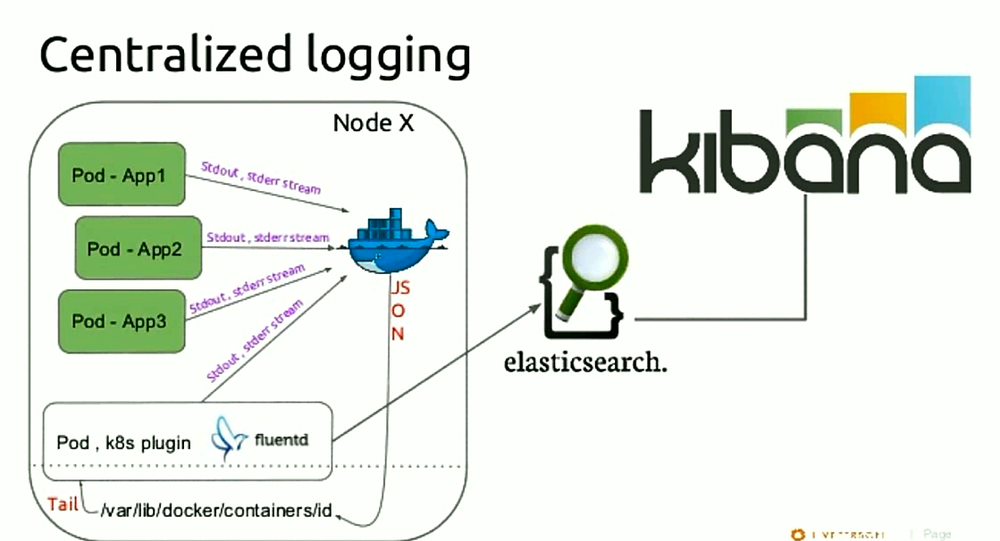

# 第12章 容器的运维与监控
## 12.1 容器的基本监控weavescope
> [weaveworks/scope](https://github.com/weaveworks/scope)

参考博客见 https://blog.51cto.com/3241766/2447151 ，博客备份了一份在当前目录：[k8s实践_监控工具WeaveScope详解](k8s实践_监控工具WeaveScope详解.md)

## 12.2 k8s集群运行资源监控：[Heapster](https://github.com/kubernetes-retired/heapster)+[Grafana](https://github.com/grafana/grafana)+[InfluxDB](https://github.com/influxdata/influxdb)

> 参考博客： https://www.jianshu.com/p/e3c1ea64b5cc

博客备份到了本地一份：[容器监控实践Heapster_Grafana_InfluxDB](容器监控实践Heapster_Grafana_InfluxDB.md)

## 12.3 根据资源占用自动横向扩缩容

K8S 作为一个集群式的管理软件，自动化、智能化是免不了的功能。Google 在 K8S v1.1 版本中就加入了这个 Pod 横向自动扩容的功能（Horizontal Pod Autoscaling，简称 HPA）。

HPA 与之前的 Deployment、Service 一样，也属于一种 K8S 资源对象。

HPA 的目标是希望通过追踪集群中所有 Pod 的负载变化情况，来自动化地调整 Pod 的副本数，以此来满足应用的需求和减少资源的浪费。

HAP 度量 Pod 负载变化情况的指标有两种：

- CPU 利用率（CPUUtilizationPercentage）
- 自定义的度量指标，比如服务在每秒之内的请求数（TPS 或 QPS）

如何统计和查询这些指标，要依托于一个组件——Heapster。Heapster 会监控一段时间内集群内所有 Pod 的 CPU 利用率的平均值或者其他自定义的值，在满足条件时（比如 CPU 使用率超过 80% 或 降低到 10%）会将这些信息反馈给 HPA 控制器，HPA 控制器就根据 RC 或者 Deployment 的定义调整 Pod 的数量。

HPA 实现的方式有两种：配置文件和命令行

### 1. 配置文件

这种方式是通过定义 yaml 配置文件来创建 HPA，如下是基本定义：

```yml
CopyapiVersion: autoscaling/v1
kind: HorizontalPodAutoscaler
metadata:
  name: php-apache
  namespace: default
spec:
  scaleTargetRef:               # (1)
    kind: Deployment   
    name: php-apache
  minReplicas: 1                # (2)
  maxReplicas: 10
  targetAverageUtilization: 50  # (3)
```

文件 kind 类型是 `HorizontalPodAutoscaler`，其中有 3 个地方需要额外注意下：

+ （1）`scaleTargetRef` 字段指定需要管理的 Deployment/RC 的名字，也就是提前需要存在一个 Deployment/RC 对象。
+ （2） `minReplicas` 和 `maxReplicas` 字段定义 Pod 可伸缩的数量范围。这个例子中扩容最高不能超过 10 个，缩容最低不能少于 1 个。
+ （3）`targetAverageUtilization` 指定 CPU 使用率，也就是自动扩容和缩容的触发条件，当 CPU 使用率超过 50% 时会触发自动动态扩容的行为，当回落到 50% 以下时，又会触发自动动态缩容的行为。

### 2. 命令行

这种方式就是通过 `kubectl autoscale` 命令来实现创建 HPA 对象，实现自动扩容和缩容行为。比如和上面的例子等价的命令如下：

```shell
kubectl autoscale deployment php-apache --cpu-percent=50 --min=1 --max=10
```
+ `--cpu-percent=50`：CPU占用率大于50%就扩容
+ `--min=1`：pod最少个数
+ `--max=10`：pod最多个数

通过参数来引入各个字段。

## 12.4 k8s集群的Log采集和展示：ELK+Flunted
> 生产环境下有成千上万的容器，如何有效的查看相应容器中的log呢？

+ Fluentd(log转发)
+ ElasticSearch(log Index)
+ Kibana(log可视化)
+ LogTrail(log UI查看)（插件）



见[labs/logging](labs/logging)里面的yml文件

## 12.5 