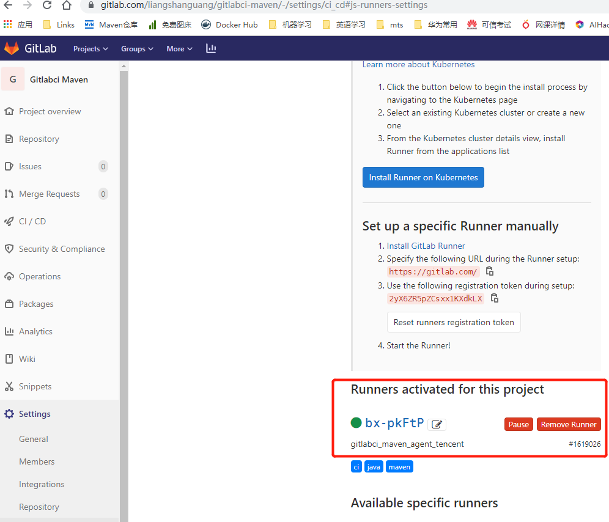
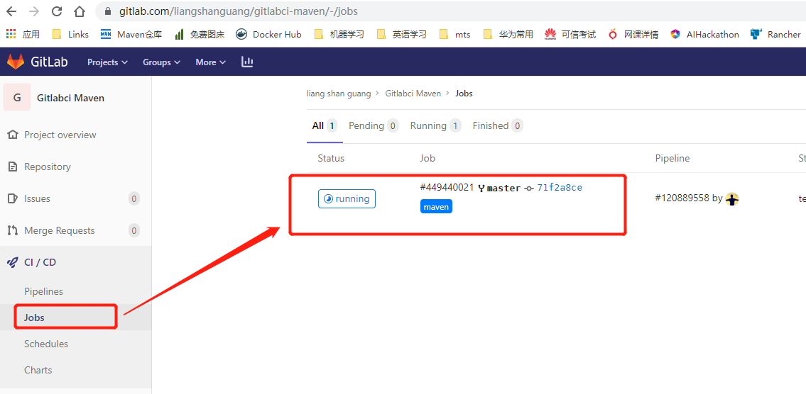

# 第13章 Docker+DevOps实战--过程和工具
> 本章的目标如下：


## 13.1 本章简介
完全采用免费的工具实现上面的基于k8s的devops
+ gitlab代替github
+ GitlabCI代替Jenkins或者TravisCI
+ 私有registry代替dockerhub

## 13.2 搭建gitlab
> 直接用共有的吧~公司内部也有

本地搭建参考[gitlab-server搭建](环境搭建脚本/labs/gitlab-server.md)

## 13.3 搭建GitlabCI服务器和Pipeline

+ 1.[gitlab-ci实战](环境搭建脚本/labs/gitlab-ci.md)
+ 2.[gitlab-ci总结](GitLabCI介绍.md)

## 13.4 基于真实Python项目的CI演示
> 以[docker-cloud-flask-demo](https://github.com/imooc-course/docker-cloud-flask-demo.git)为例，导入到[gitlab](https://gitlab.com/liangshanguang/docker-cloud-flask-demo)中

## 13.5 基于Java项目的CI演示
> [代码地址](https://gitlab.com/liangshanguang/gitlabci-maven)


```shell
[root@VM_0_15_centos python_docker_ci_demo]# gitlab-ci-multi-runner register
Running in system-mode.

Please enter the gitlab-ci coordinator URL (e.g. https://gitlab.com/):
https://gitlab.com/
Please enter the gitlab-ci token for this runner:
2yX6ZR5pZCsxx1KXdkLX
Please enter the gitlab-ci description for this runner:
[VM_0_15_centos]: gitlabci_maven_agent_tencent
Please enter the gitlab-ci tags for this runner (comma separated):
maven,java,ci
Whether to run untagged builds [true/false]:
[false]:
Whether to lock Runner to current project [true/false]:
[false]:
Registering runner... succeeded                     runner=2yX6ZR5p
Please enter the executor: ssh, virtualbox, docker+machine, docker-ssh+machine, parallels, shell, kubernetes, docker, docker-ssh:
docker
Please enter the default Docker image (e.g. ruby:2.1):
maven:latest
Runner registered successfully. Feel free to start it, but if it's running already the config should be automatically reloaded!
```

gitlabci的agent注册结果如下：




.gitlab-ci.yml的内容

```yml
# These are the default stages. You don't need to explicitly define them. But you could define any stages you need.
stages:
  - build
  - test
  - deploy

# This is the name of the job. You can choose it freely.
maven_build:
  # A job is always executed within a stage. If no stage is set, it defaults to 'test'
  stage: test
  # Since we require Maven for this job, we can restrict the job to runners with a certain tag. Of course, we need to configure a runner with the tag maven with a maven installation
  tags:
    - maven
  # Here you can execute arbitrate terminal commands.
  # If any of the commands returns a non zero exit code the job fails
  script:
    - echo "Building project with maven"
    - mvn verify
```

运行过程如下：


