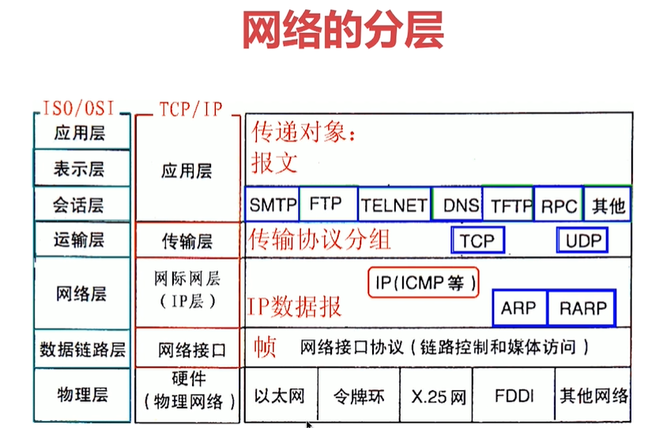
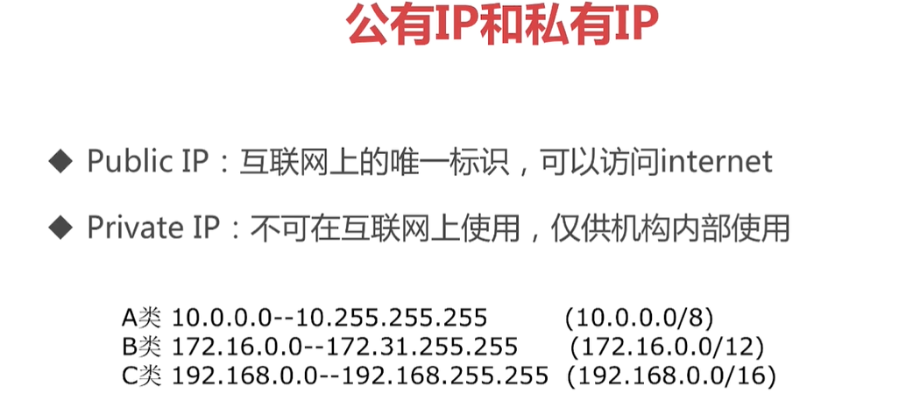
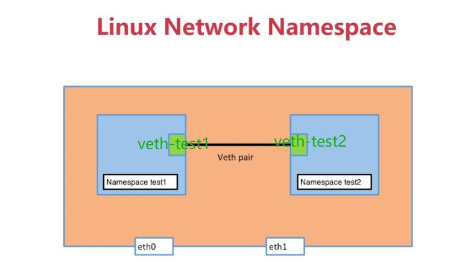
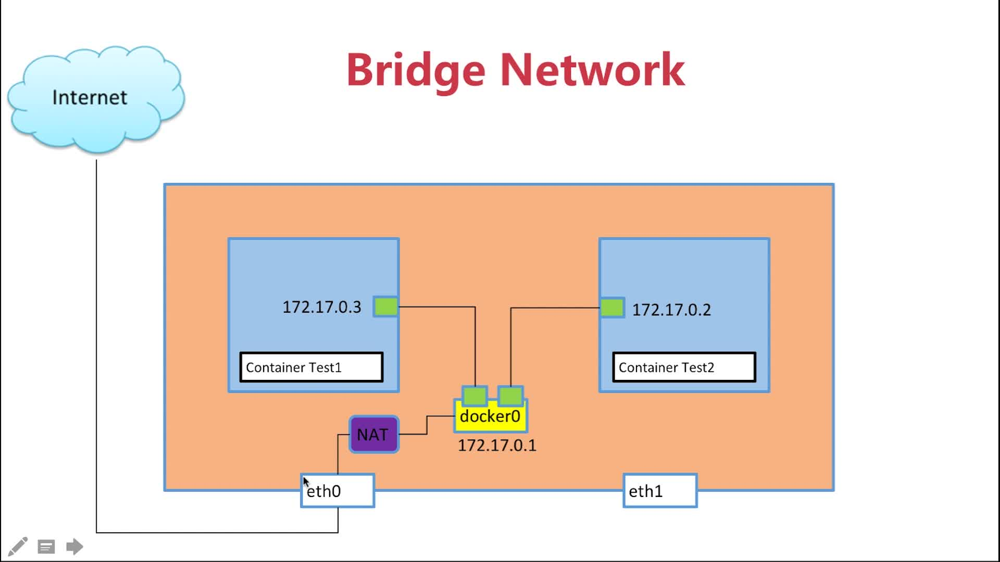

# Docker之间的网络

## 4-1 本章概述和实验环境介绍
+ 单机通信
  + Bridge NetWork
  + Host NetWork
  + None NetWork
+ 多机通信
  + Overlay NetWork

## 4-2 网络基础

### 网络的分层


### 共有IP和私有IP


### 内网私有地址访问公网的方式NAT


### ping和telenet

+ ping:验证IP的可达性
+ telnet:验证服务的可用性，`telnet ip port`返回connected表示服务可用，返回refused表示服务挂了
  > 


## 4-3 Linux命名空间

### Docker所用的基础Linux网络namespace 

+ `sudo ip netns list` 列出当前机器的namespace
+ `sudo ip netns add sir1` 向本地机器添加一个名字叫sir1的namespace
+ `sudo ip netns del sir1`  在本地机器上删除一个名字叫sir1的namespace
+ `sudo ip netns exec sir1 ip a` 查看名字叫做sir1的namespace的本地接口
+ `sudo ip netns exec sir1 link` 查看名字叫做sir1的namespace的本地链路情况

### 容器网络相关命令

+ 查看当前容器的内部网络：`docker exec -it 容器id ip a`
+ 查看当前容器的内部链路情况：`docker exec -it 容器id ip link`

### 查看不同容器的网络和命名空间
```powershell
[root@localhost ~]# docker run -d --name test1 busybox /bin/sh -c "while true;do sleep 3600;done"
[root@localhost ~]# docker ps
CONTAINER ID        IMAGE               COMMAND                  CREATED             STATUS              PORTS               NAMES
6025307db564        busybox             "/bin/sh -c 'while..."   54 seconds ago      Up 53 seconds                           test1
[root@localhost ~]# docker exec -it 6025307db564 /bin/sh
/ # ip a
....
回显即为命名空间
....
/ # exit
[root@localhost ~]# ip a
......
主机的命名空间
......
[root@localhost ~]# docker run -d --name test2 busybox /bin/sh -c "while true;do sleep 3600;done"
[root@localhost ~]# docker ps
CONTAINER ID        IMAGE               COMMAND                  CREATED             STATUS              PORTS               NAMES
2da2eb5316cb        busybox             "/bin/sh -c 'while..."   46 seconds ago      Up 45 seconds                           test2
6025307db564        busybox             "/bin/sh -c 'while..."   5 minutes ago       Up 5 minutes                            test1
[root@localhost ~]# docker exec 6025307db564 ip a
......
返回地容器test2的命名空间
......
[root@localhost ~]# docker exec -it 6025307db564 /bin/sh
/ # ping 172.17.0.1
// 下面的回显表明可以在容器test2中ping通test1
PING 172.17.0.1 (172.17.0.1): 56 data bytes
64 bytes from 172.17.0.1: seq=0 ttl=64 time=0.049 ms
64 bytes from 172.17.0.1: seq=1 ttl=64 time=0.037 ms
64 bytes from 172.17.0.1: seq=2 ttl=64 time=0.035 ms
```

### 命名空间查看与操作

+ `ip a` 表示ip address (show)，相当于显示IP地址信息，偏向于上层。
+ `ip link`表示 `ip link(show)`， 表示链路层的信息，更底层，偏向于物理层，如你可以设置网卡的up down，那么就是 ip link set down ethX, ip link set up ethX

```powershell
# Linux network namespace(简称ns,netns就是network namespace的意思)
ip netns list # 查看命名空间列表
ip netns add test1 # 添加指定名称的命名空间
ip netns delete test1 # 删除指定名称的命名空间
ip netns exec test1 ip a # 查看命名空间test1内的IP地址信息
ip netns exec test1 ip link # 查看命名空间test1的所有链路信息
ip link add veth-test1 type veth peer name veth-test2 # 设置两个互连的veth网络，为后面test1和test2网络连接做准备
ip netns exec test1 ip addr add 192.168.1.1/24 dev veth-test1 # 给veth端口绑定ip，然后才能和其他的veth端口互连
ip netns exec test2 ip link set dev veth-test2 up
```

### 命名空间实战
```powershell
[root@localhost ~]# ip netns list
[root@localhost ~]# ip netns add test1
[root@localhost ~]# ip netns list
test1
[root@localhost ~]# ip netns add test2
[root@localhost ~]# ip netns list
test2
test1
[root@localhost ~]# ip netns exec test1 ip a
1: lo: <LOOPBACK> mtu 65536 qdisc noop state DOWN qlen 1 # DOWN表示当前端口没有用起来
    link/loopback 00:00:00:00:00:00 brd 00:00:00:00:00:00
[root@localhost ~]# ip link // 查看主机的链路信息
1: lo: <LOOPBACK,UP,LOWER_UP> mtu 65536 qdisc noqueue state UNKNOWN mode DEFAULT qlen 1
    link/loopback 00:00:00:00:00:00 brd 00:00:00:00:00:00
2: enp0s3: <BROADCAST,MULTICAST,UP,LOWER_UP> mtu 1500 qdisc pfifo_fast state UP mode DEFAULT qlen 1000
    link/ether 08:00:27:54:8e:3b brd ff:ff:ff:ff:ff:ff
3: docker0: <NO-CARRIER,BROADCAST,MULTICAST,UP> mtu 1500 qdisc noqueue state DOWN mode DEFAULT
    link/ether 02:42:7b:c9:a0:59 brd ff:ff:ff:ff:ff:ff
[root@localhost ~]# ip netns exec test1 ip link // 查看自定义命令空间的链路信息
1: lo（链路名称，重点关注，下面有用）: <LOOPBACK> mtu 65536 qdisc noop state DOWN mode DEFAULT qlen 1
    link/loopback 00:00:00:00:00:00 brd 00:00:00:00:00:00
[root@localhost ~]# ip netns exec test1 ip link set dev lo up // 把lo端口up起来，会成为UnKnown，因为想up必须是两个端口相连
[root@localhost ~]# ip netns exec test1 ip link
1: lo: <LOOPBACK,UP,LOWER_UP> mtu 65536 qdisc noqueue state UNKNOWN（从Down变成UnKnown了，要想变成up必须是两个端口相连） mode DEFAULT qlen 1
    link/loopback 00:00:00:00:00:00 brd 00:00:00:00:00:00
```
需要用两个Veth端口把两个命名空间连接起来，这样两个命名空间的链路才能都up起来，否则就会是Down或UnKnown。如下图


接上面继续执行命令
```powershell
[root@localhost ~]# ip link add veth-test1 type veth peer name veth-test2 # 现在本地创建两个veth链路，为连接命名空间test1和test2做准备
[root@localhost ~]# ip link # 查看此时主机的链路情况，可以看到刚加的veth-test1和veth-test2
1: lo: <LOOPBACK,UP,LOWER_UP> mtu 65536 qdisc noqueue state UNKNOWN mode DEFAULT qlen 1
    link/loopback 00:00:00:00:00:00 brd 00:00:00:00:00:00
2: enp0s3: <BROADCAST,MULTICAST,UP,LOWER_UP> mtu 1500 qdisc pfifo_fast state UP mode DEFAULT qlen 1000
    link/ether 08:00:27:54:8e:3b brd ff:ff:ff:ff:ff:ff
3: docker0: <NO-CARRIER,BROADCAST,MULTICAST,UP> mtu 1500 qdisc noqueue state DOWN mode DEFAULT
    link/ether 02:42:7b:c9:a0:59 brd ff:ff:ff:ff:ff:ff
12: veth-test2@veth-test1（新加的veth网络）: <BROADCAST,MULTICAST,M-DOWN> mtu 1500 qdisc noop state DOWN mode DEFAULT qlen 1000
    link/ether 22:97:d2:6f:61:13 brd ff:ff:ff:ff:ff:ff
13: veth-test1@veth-test2（新加的veth网络）: <BROADCAST,MULTICAST,M-DOWN> mtu 1500 qdisc noop state DOWN mode DEFAULT qlen 1000
    link/ether 92:08:f0:a6:24:47 brd ff:ff:ff:ff:ff:ff
[root@localhost ~]# ip netns exec test1 ip link // 可以看到此时test1内的链路情况还没变，下面把veth-test1添加到命名空间test1后就会变化了
1: lo: <LOOPBACK,UP,LOWER_UP> mtu 65536 qdisc noqueue state UNKNOWN mode DEFAULT qlen 1
    link/loopback 00:00:00:00:00:00 brd 00:00:00:00:00:00
[root@localhost ~]# ip link set veth-test1 netns test1 //把veth-test1添加到命名空间test1
[root@localhost ~]# ip netns exec test1 ip link // 再看命名空间test1内的链路就变了
1: lo: <LOOPBACK,UP,LOWER_UP> mtu 65536 qdisc noqueue state UNKNOWN mode DEFAULT qlen 1
    link/loopback 00:00:00:00:00:00 brd 00:00:00:00:00:00
13: veth-test1@if12: <BROADCAST,MULTICAST> mtu 1500 qdisc noop state DOWN mode DEFAULT qlen 1000
    link/ether 92:08:f0:a6:24:47 brd ff:ff:ff:ff:ff:ff link-netnsid 0
[root@localhost ~]# ip link // 起初创建于本机网络的veth-test1被添加到test1后就不存在与主机上了
1: lo: <LOOPBACK,UP,LOWER_UP> mtu 65536 qdisc noqueue state UNKNOWN mode DEFAULT qlen 1
    link/loopback 00:00:00:00:00:00 brd 00:00:00:00:00:00
2: enp0s3: <BROADCAST,MULTICAST,UP,LOWER_UP> mtu 1500 qdisc pfifo_fast state UP mode DEFAULT qlen 1000
    link/ether 08:00:27:54:8e:3b brd ff:ff:ff:ff:ff:ff
3: docker0: <NO-CARRIER,BROADCAST,MULTICAST,UP> mtu 1500 qdisc noqueue state DOWN mode DEFAULT
    link/ether 02:42:7b:c9:a0:59 brd ff:ff:ff:ff:ff:ff
12: veth-test2@if13（只有veth-test2了，veth-test1已经被添加到命名空间test1了）: <BROADCAST,MULTICAST> mtu 1500 qdisc noop state DOWN mode DEFAULT qlen 1000
    link/ether 22:97:d2:6f:61:13 brd ff:ff:ff:ff:ff:ff link-netnsid 0
[root@localhost ~]# ip netns exec test2 ip link // 可以看到此时test2内的链路情况还没变，下面把veth-test2添加到命名空间test2后就会变化了
1: lo: <LOOPBACK> mtu 65536 qdisc noop state DOWN mode DEFAULT qlen 1
    link/loopback 00:00:00:00:00:00 brd 00:00:00:00:00:00
[root@localhost ~]# ip link set veth-test2 netns test2 //把veth-test2添加到命名空间test2
[root@localhost ~]# ip netns exec test2 ip link // 再看命名空间test2内的链路就变了
1: lo: <LOOPBACK> mtu 65536 qdisc noop state DOWN mode DEFAULT qlen 1
    link/loopback 00:00:00:00:00:00 brd 00:00:00:00:00:00
12: veth-test2@if13: <BROADCAST,MULTICAST> mtu 1500 qdisc noop state DOWN mode DEFAULT qlen 1000
    link/ether 22:97:d2:6f:61:13 brd ff:ff:ff:ff:ff:ff link-netnsid 0
[root@localhost ~]# ip link // 主机网络里veth-test1和veth-test2都不见了
1: lo: <LOOPBACK,UP,LOWER_UP> mtu 65536 qdisc noqueue state UNKNOWN mode DEFAULT qlen 1
    link/loopback 00:00:00:00:00:00 brd 00:00:00:00:00:00
2: enp0s3: <BROADCAST,MULTICAST,UP,LOWER_UP> mtu 1500 qdisc pfifo_fast state UP mode DEFAULT qlen 1000
    link/ether 08:00:27:54:8e:3b brd ff:ff:ff:ff:ff:ff
3: docker0: <NO-CARRIER,BROADCAST,MULTICAST,UP> mtu 1500 qdisc noqueue state DOWN mode DEFAULT
    link/ether 02:42:7b:c9:a0:59 brd ff:ff:ff:ff:ff:ff
[root@localhost ~]# ip netns exec test1 ip addr add 192.168.1.1/24 dev veth-test1 // 给veth端口绑定ip，然后才能和其他的veth端口互连
[root@localhost ~]# ip netns exec test2 ip addr add 192.168.1.2/24 dev veth-test2 // 给veth端口绑定ip，然后才能和其他的veth端口互连
[root@localhost ~]# ip netns exec test1 ip link // 绑定了ip，对应的veth端口还没UP起来，仍然是Down地
1: lo: <LOOPBACK,UP,LOWER_UP> mtu 65536 qdisc noqueue state UNKNOWN mode DEFAULT qlen 1
    link/loopback 00:00:00:00:00:00 brd 00:00:00:00:00:00
13: veth-test1@if12（veth端口）: <BROADCAST,MULTICAST> mtu 1500 qdisc noop state DOWN（仍然是Down地） mode DEFAULT qlen 1000
    link/ether 92:08:f0:a6:24:47 brd ff:ff:ff:ff:ff:ff link-netnsid 1
[root@localhost ~]# ip netns exec test2 ip link // 绑定了ip，对应的veth端口还没UP起来，仍然是Down地
1: lo: <LOOPBACK> mtu 65536 qdisc noop state DOWN mode DEFAULT qlen 1
    link/loopback 00:00:00:00:00:00 brd 00:00:00:00:00:00
12: veth-test2@if13（veth端口）: <BROADCAST,MULTICAST> mtu 1500 qdisc noop state DOWN（仍然是Down地） mode DEFAULT qlen 1000
    link/ether 22:97:d2:6f:61:13 brd ff:ff:ff:ff:ff:ff link-netnsid 0
[root@localhost ~]# ip netns exec test1 ip link set dev veth-test1 up // veth端口UP起来了
[root@localhost ~]# ip netns exec test2 ip link set dev veth-test2 up // veth端口UP起来了
[root@localhost ~]# ip netns exec test1 ip link // 确认链路信息
1: lo: <LOOPBACK,UP,LOWER_UP> mtu 65536 qdisc noqueue state UNKNOWN mode DEFAULT qlen 1
    link/loopback 00:00:00:00:00:00 brd 00:00:00:00:00:00
13: veth-test1@if12（veth端口）: <BROADCAST,MULTICAST,UP,LOWER_UP> mtu 1500 qdisc noqueue state UP（veth端口UP起来了） mode DEFAULT qlen 1000
    link/ether 92:08:f0:a6:24:47 brd ff:ff:ff:ff:ff:ff link-netnsid 1
[root@localhost ~]# ip netns exec test2 ip link // 确认链路信息
1: lo: <LOOPBACK> mtu 65536 qdisc noop state DOWN mode DEFAULT qlen 1
    link/loopback 00:00:00:00:00:00 brd 00:00:00:00:00:00
12: veth-test2@if13（veth端口）: <BROADCAST,MULTICAST,UP,LOWER_UP> mtu 1500 qdisc noqueue state UP（veth端口UP起来了） mode DEFAULT qlen 1000
    link/ether 22:97:d2:6f:61:13 brd ff:ff:ff:ff:ff:ff link-netnsid 0
[root@localhost ~]# ip netns exec test1 ip a // 查看命名空间1，可以看到我们自己创建的veth-test1已经分配好ip 192.168.1.1/24了
1: lo: <LOOPBACK,UP,LOWER_UP> mtu 65536 qdisc noqueue state UNKNOWN qlen 1
    link/loopback 00:00:00:00:00:00 brd 00:00:00:00:00:00
    inet 127.0.0.1/8 scope host lo
       valid_lft forever preferred_lft forever
    inet6 ::1/128 scope host
       valid_lft forever preferred_lft forever
13: veth-test1@if12（veth端口）: <BROADCAST,MULTICAST,UP,LOWER_UP> mtu 1500 qdisc noqueue state UP qlen 1000
    link/ether 92:08:f0:a6:24:47 brd ff:ff:ff:ff:ff:ff link-netnsid 1
    inet 192.168.1.1/24（已经分配好ip了） scope global veth-test1
       valid_lft forever preferred_lft forever
    inet6 fe80::9008:f0ff:fea6:2447/64 scope link
       valid_lft forever preferred_lft forever
[root@localhost ~]# ip netns exec test2 ip a
1: lo: <LOOPBACK> mtu 65536 qdisc noop state DOWN qlen 1
    link/loopback 00:00:00:00:00:00 brd 00:00:00:00:00:00
12: veth-test2@if13（veth端口）: <BROADCAST,MULTICAST,UP,LOWER_UP> mtu 1500 qdisc noqueue state UP qlen 1000
    link/ether 22:97:d2:6f:61:13 brd ff:ff:ff:ff:ff:ff link-netnsid 0
    inet 192.168.1.2/24（已经分配好ip了） scope global veth-test2
       valid_lft forever preferred_lft forever
    inet6 fe80::2097:d2ff:fe6f:6113/64 scope link
       valid_lft forever preferred_lft forever
[root@localhost ~]# ip netns exec test1 ping 192.168.1.2 // 在命名空间test1中ping命名空间test2的veth-test2的ip地址192.168.1.2能ping通，表明我们把两个命名空间连接起来了，可以理解为把两个互相隔离的容器联通了(因为每个容器实际就是用不同的命名空间区分和隔离的)~~
PING 192.168.1.2 (192.168.1.2) 56(84) bytes of data.
64 bytes from 192.168.1.2: icmp_seq=1 ttl=64 time=0.033 ms
64 bytes from 192.168.1.2: icmp_seq=2 ttl=64 time=0.023 ms
64 bytes from 192.168.1.2: icmp_seq=3 ttl=64 time=0.023 ms
64 bytes from 192.168.1.2: icmp_seq=4 ttl=64 time=0.023 ms
64 bytes from 192.168.1.2: icmp_seq=5 ttl=64 time=0.024 ms
[root@localhost ~]# ip netns exec test2 ping 192.168.1.1 // 同上，在命名空间test2中ping命名空间test1的veth-test1的ip地址192.168.1.1也是能ping通，两个命名空间是双向联通的
PING 192.168.1.1 (192.168.1.1) 56(84) bytes of data.
64 bytes from 192.168.1.1: icmp_seq=1 ttl=64 time=0.022 ms
64 bytes from 192.168.1.1: icmp_seq=2 ttl=64 time=0.041 ms
64 bytes from 192.168.1.1: icmp_seq=3 ttl=64 time=0.024 ms
64 bytes from 192.168.1.1: icmp_seq=4 ttl=64 time=0.024 ms
```

Linux的命名空间以及Veth的讲解的很好的博客[Linux 虚拟网络设备 veth-pair 详解，看这一篇就够了](https://www.cnblogs.com/bakari/p/10613710.html)

重要知识点：Veth端口必须成对配置并连接起来才能是UP的

## 4-4 Docker bridge0详解

+ `docker network ls`查看当前容器网络

  ```shell
  ~ docker network ls
  NETWORK ID          NAME                DRIVER              SCOPE
  d4fbf27ee62d        bridge              bridge              local
  cdd4aae5c96b        host                host                local
  12289bcbd3c9        none                null                local
  ```

+ `docker network inspect NETWORK_ID`:查看网络的信息，比如哪些容器在连接这个网络，回显例子如下

  ```shell
  ~ docker network inspect d4fbf27ee62d
  [
      {
          "Name": "bridge",
          "Id": "d4fbf27ee62d12def630d049f020a3fe8d268743af83d4807a9f865d333eb141",
          "Created": "2019-06-18T11:23:57.338996882+08:00",
          "Scope": "local",
          "Driver": "bridge",
          "EnableIPv6": false,
          "IPAM": {
              "Driver": "default",
              "Options": null,
              "Config": [
                  {
                      "Subnet": "172.17.0.0/16"
                  }
              ]
          },
          "Internal": false,
          "Attachable": false,
          "Containers": {
              "6162392d72a04762ef2ee29dc64fdd596e1a9c25b6790351ca3e32044fe6f704": {
                  "Name": "r-network-services-metadata-2-036a641b",
                  "EndpointID": "e6919a66d815fd051819d36fc0bc3258f96a706bdc27f0d2e7679a53b60d5e7d",
                  "MacAddress": "02:21:7b:ea:04:a8",
                  "IPv4Address": "172.17.0.5/16",
                  "IPv6Address": ""
              },
              "73e462a9e5c1e647311fea9c3805be2e853005289f10f32fc3b120158ae3391e": {
                  "Name": "mysql-exam",
                  "EndpointID": "b46bc165db338194114aaaebd7c2d671c5a37a34da1153ea93d0b0a7c4a20cdf",
                  "MacAddress": "02:42:ac:11:00:03",
                  "IPv4Address": "172.17.0.3/16",
                  "IPv6Address": ""
              },
              "d7cd19ea69ffe16933fef4f79e5aa01fdd00af456ae8cf058edda21502d4336d": {
                  "Name": "kickass_wescoff",
                  "EndpointID": "574c92eef1ab03c25bf9a1244071becada7bbe216f91f037f9dc1ff558567dad",
                  "MacAddress": "02:42:ac:11:00:04",
                  "IPv4Address": "172.17.0.4/16",
                  "IPv6Address": ""
              }
          },
          "Options": {
              "com.docker.network.bridge.default_bridge": "true",
              "com.docker.network.bridge.enable_icc": "true",
              "com.docker.network.bridge.enable_ip_masquerade": "true",
              "com.docker.network.bridge.host_binding_ipv4": "0.0.0.0",
              "com.docker.network.bridge.name": "docker0",
              "com.docker.network.driver.mtu": "1500"
          },
          "Labels": {}
      }
  ]
  ```

+ brctl:查看桥接网络的工具,对查看容器网络很有用，bridge control，可以用`yum install bridge-utils`来安装
  + `brctl show`:查看当前的桥接网络

    ```shell
    ~ brctl show
    bridge name     bridge id               STP enabled     interfaces
    docker0         8000.0242c6b40778       no              veth3d5652d
                                                            veth59d16b2
                                                            vethd00045b
                                                            vethr0d37319229
                                                            vethr9349990d4f
    ```

+ bridge0的作用
  + 
  + 总结1，所有的容器的网络连接都是连接到宿主机的docker0上。然后宿主机上会起一个veth连接到docker0上。然后容器上的veth和宿主机上的veth是一对。这样就实现了容器互通。
  + 总结2.docker0是宿主机上的网桥，docker0又是连接internet的，所以就实现容器访问互联网
  
## 4-5 容器之间的link

> 通过link,各个容器之间连接可以用名称来连接，避免每次容器启动的名称都不一样的问题，例子`--link 容器名或者id`

+ 新建bridge:`docker network create -d bridge mybridge`
+ 将容器连接到mybridge 网络上:`docker network connect mybridge test`
+ 使用自定的bridge网络创建容器:`docker run --network mybridge --name test -d busybox`
+ 查看网络详细信息:`docker network inspect mybridge`

如果容器连接到了用户自己创建的bridge上，那么即使不用link也是可以通过名字相互ping通的

```shell
docker run -d  --name test --link test1  busybox /bin/sh -c "while true; do sleep 3600; done"
docker network create -d bridge mybridge
docker network inspect mybridge
docker network connect mybridge test
docker exec -it test /bin/sh
```

## 4-6 端口映射

`docker run --name web-server -d -p 80:80 nginx`

## 4-7 容器网络之host和none

> host方式表示容器和所在主机的网络完全一致

+ `docker run --network host xxx`:主机网络启动
+ `docker run --network none xxx`:主机网络启动

## 4-8 多容器复杂应用的部署

> 例子见flask-redis-demo文件夹，用到的命令如下

+ 先启动redis服务器：`docker run -d --name redis redis`
+ 切入到flask-redis-demo并执行如下命令：`docker build -t waterknife/flask-redis-demo .`
+ 启动上一步制作的镜像：`docker run -d -p 5000:5000 --link redis --name flask-redis -e REDIS_HOST=redis waterknife/flask-redis-demo`

## 4-9 多机容器间的通信：Overlay和Underlay的通俗解释

两个不同公网ip的机器上的容器直接通信是不行地，但是可以通过在主机socket包中携带容器的数据包，到目标机器上再解包，从而实现不同机器上的容器通信。这个功能相当于一个隧道，官方名称VXLAN


VALAN原理图如下：


## 4-10 多机通信实战

+ 1、分别在两个节点上安装etcd cluster, 检查ectd的健康状态
+ 2、分别在两个节点上重启docker服务，重启的时候参数里配置cluster分布式共享存储，重启之后就有共享存储了
+ 3、在其中一个节点创建一个overlay类型的demo网络，在另一个节点上也能发现
+ 4、分别将各自节点上的应用通过--net demo参数启动镜像，都添加到demo里，两个各自节点上的应用就能互相通信了
