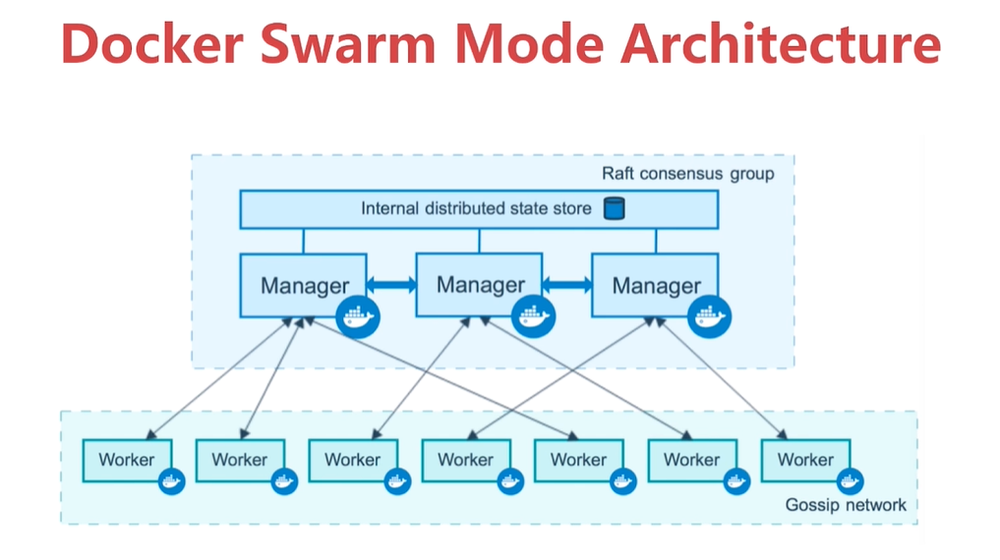
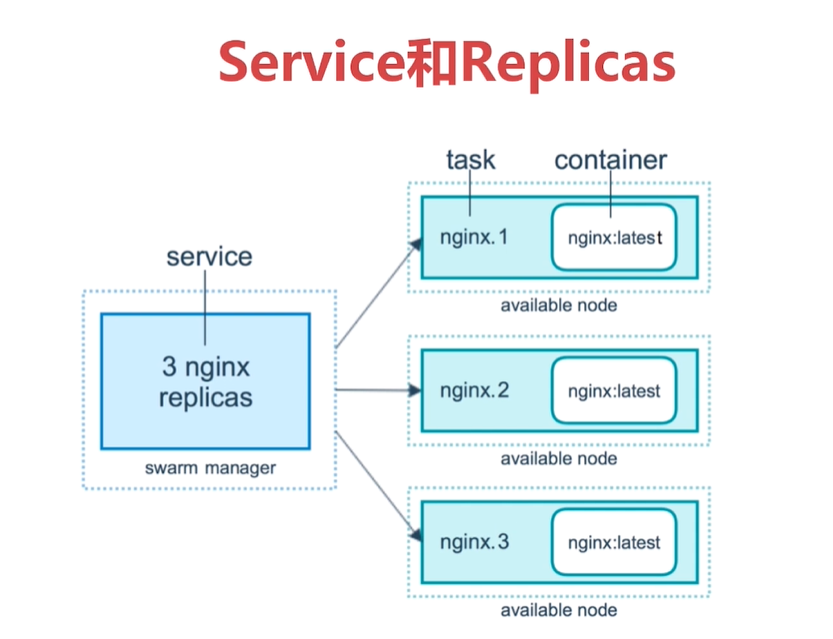
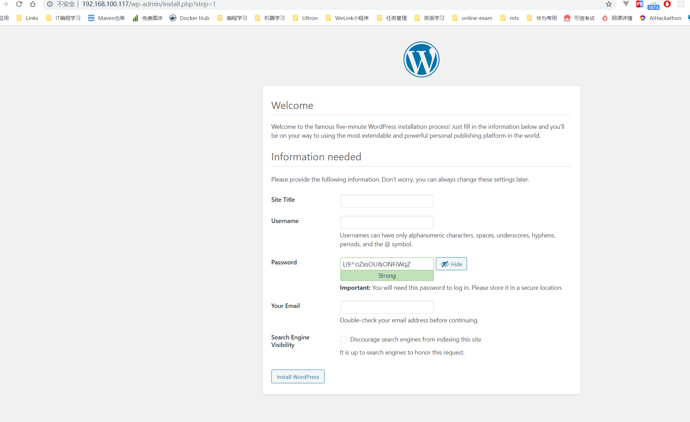
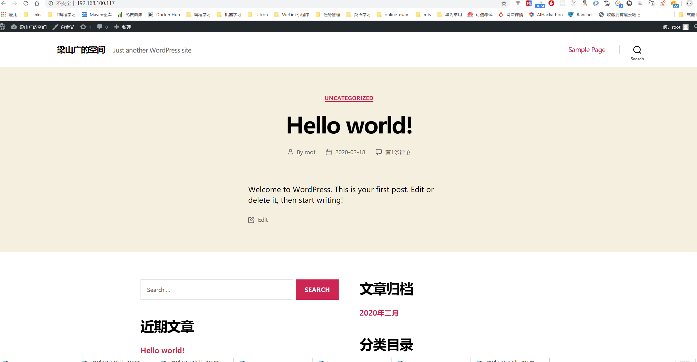

# 容器编排Docker Swarm

## 7.1 Docker Swarm介绍

### 使用容器的麻烦之处
+ 怎么去管理这么多容器
+ 怎么能方便的横向扩展
+ 如何去更新容器而不影响业务
+ 如何去调度追踪这些容器
+ 怎么去调度容器的创建
+ 保护隐私数据

### Swarm的原理图示
> 初学者接触容器编排学到的第一个工具

使用图示如下：

原理图示如下：

以redis部署3个节点为例：

Swarm服务创建与调度过程如下：


## 7.2 创建一个3节点的Swarm集群
> 三台机器的ip分别是192.168.100.116、192.168.100.117、192.168.100.116

### 创建manager节点
> 把192.168.100.116作为manager节点`docker swarm init --advertise-addr=192.168.100.116`
```powershell
[root@localhost ~]#  docker swarm init --advertise-addr=192.168.100.116
Swarm initialized: current node (6rjcjgv4a1znrfjughoow8hdy) is now a manager.

To add a worker to this swarm, run the following command:

    docker swarm join \
    --token SWMTKN-1-0ckgcq7w0bdtwrgwgwelun20p6v4127k3hp433jz89k8uemqfx-75e4xtannco7fu5khddjoh9kx \
    192.168.100.116:2377

To add a manager to this swarm, run 'docker swarm join-token manager' and follow the instructions.
```
### 把117和118加入到swarm集群成为worker节点
```powershell
[root@localhost ~]#   docker swarm join \
>     --token SWMTKN-1-0ckgcq7w0bdtwrgwgwelun20p6v4127k3hp433jz89k8uemqfx-75e4xtannco7fu5khddjoh9kx \
>     192.168.100.116:2377
This node joined a swarm as a worker.
```

### 在116上查看集群情况
```powershell
[root@localhost ~]# docker node ls
ID                           HOSTNAME  STATUS  AVAILABILITY  MANAGER STATUS
b1afoe8r6hff54s23sp1t9vt4    worker1   Ready   Active
el8xrk78q1149fqhukqt18pwr *  manager   Ready   Active        Leader
kd3k5oop5agp11z8pym3xapzs    worker2   Ready   Active
```

## 7.3 Service的创建维护和水平扩展
### 创建一个服务
> docker service create 创建一个service，类似于在本地执行docker run，但是在cluster环境下都用docker service create
```powershell
[root@localhost ~]# docker service create --name demo busybox sh -c "while true;do sleep 3600;done" // 创建服务，默认一个节点
g0xiw08mld3pcwxb5ivfsldms
[root@localhost ~]# docker ps // 查看创建的容器
CONTAINER ID        IMAGE                                                                             COMMAND                  CREATED             STATUS              PORTS               NAMES
595854511c20        busybox@sha256:6915be4043561d64e0ab0f8f098dc2ac48e077fe23f488ac24b665166898115a   "sh -c 'while true..."   31 seconds ago      Up 30 seconds                           demo.1.o1z63v61a55c1hx6jp6lh5l03
[root@localhost ~]# docker service ps demo // 查看创建的服务
ID            NAME    IMAGE           NODE     DESIRED STATE  CURRENT STATE           ERROR  PORTS
y56n5g6v56kw  demo.1  busybox:latest  manager  Running        Running 48 seconds ago
[root@localhost ~]# docker service ls // 列出所有的服务
ID            NAME  MODE        REPLICAS  IMAGE
g0xiw08mld3p  demo  replicated  1/1       busybox:latest
```

### 服务的扩展
```powershell
[root@localhost ~]# docker service ls
ID            NAME  MODE        REPLICAS  IMAGE
g0xiw08mld3p  demo  replicated  5/5       busybox:latest
[root@manager ~]# docker service scale demo=5 // 服务的容器数扩容到5个
demo scaled to 5
[root@manager ~]# docker service ps demo // 查看此时的服务信息
ID            NAME    IMAGE           NODE     DESIRED STATE  CURRENT STATE           ERROR  PORTS
y56n5g6v56kw  demo.1  busybox:latest  manager  Running        Running 2 minutes ago
l32x8zrwtegc  demo.2  busybox:latest  worker2  Running        Running 10 seconds ago
76j9agmfpg3h  demo.3  busybox:latest  manager  Running        Running 10 seconds ago
w3cn8o04naq9  demo.4  busybox:latest  worker1  Running        Running 10 seconds ago
y6b62xi6w84b  demo.5  busybox:latest  worker2  Running        Running 10 seconds ago
[root@manager ~]# docker service rm demo // 删除demo服务
demo
```

## 7.4 在swarm集群里通过service部署wordpress
### 1.创建overlay网络
```powershell
[root@manager ~]# docker network create -d overlay demo
2vjs0y1n2tqvuuiiohi3pe9tz
[root@manager ~]# docker ps
CONTAINER ID        IMAGE               COMMAND             CREATED             STATUS              PORTS               NAMES
[root@manager ~]# docker network ls
NETWORK ID          NAME                DRIVER              SCOPE
1167462d60b2        bridge              bridge              local
2vjs0y1n2tqv        demo                overlay             swarm
5a5b4db8db19        docker_gwbridge     bridge              local
c27645bea545        host                host                local
ltncyma2v0e7        ingress             overlay             swarm
cd3a13dd8dcb        mybridge            bridge              local
fcab1d25df11        none                null                local
```
### 2.启动mysql
```powershell
[root@manager ~]# docker service create --name mysql --env MYSQL_ROOT_PASSWORD=root --env MYSQL_DATABASE=wordpress --network demo --mount type=volume,source=mysql-data,destination=/var/lib/mysql mysql:5.7.15
3uvj3yhqmzcx2n9avva3yqz3h
[root@manager ~]# docker service ps mysql
ID            NAME     IMAGE         NODE     DESIRED STATE  CURRENT STATE             ERROR  PORTS
lfpvzp38jkdi  mysql.1  mysql:5.7.15  manager  Running        Running 11 seconds ago
```
### 3.启动wordpress
```powershell
[root@manager ~]# docker service create --name wordpress -p 80:80 --env WORDPRESS_DB_PASSWORD=root --env WORDPRESS_DB_HOST=mysql --network demo wordpress
yus2hr15jhpjcnjpealew8bqz
[root@manager ~]# docker service ps wordpress
ID            NAME         IMAGE             NODE     DESIRED STATE  CURRENT STATE            ERROR  PORTS
aksbn70gzpos  wordpress.1  wordpress:latest  worker1  Running        Preparing 9 seconds ago
```

### 访问work1的ip192.168.100.117，可以看到wordpress已经正式可用了



### 注意点
docker swarm在manager节点创建了overlay的network之后，另外的worker主机不会立即创建该网络，而是等到需要的时候才会创建。比如本例当worker1的Wordpress需要使用manager上的mysql时候，worker1就会自动创建该overlay网络了。之前第三方etcd所实现的功能就由docker swarm代替。