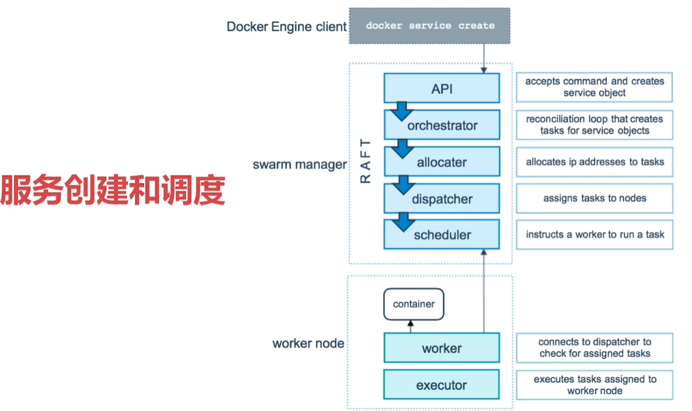
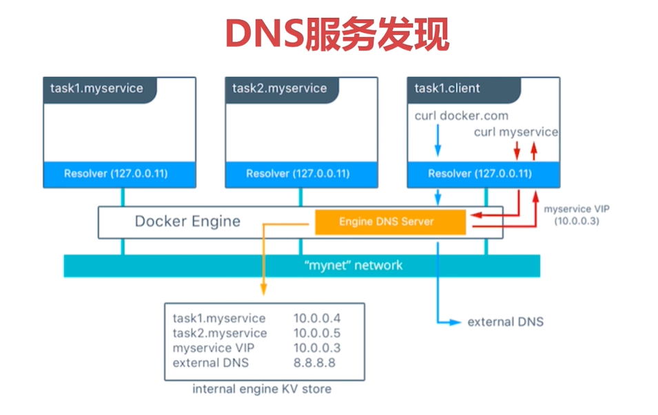
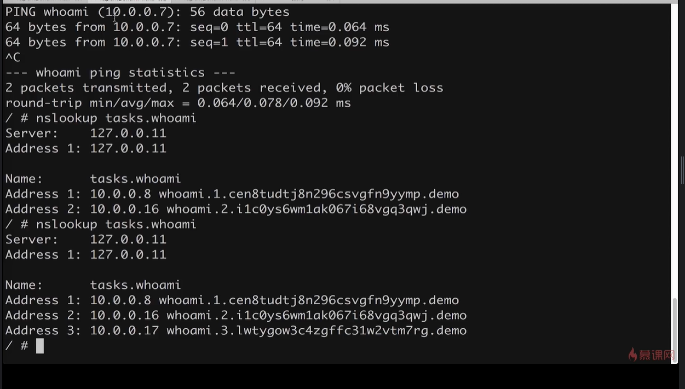
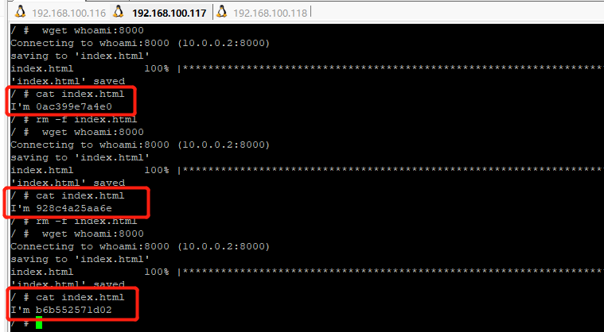
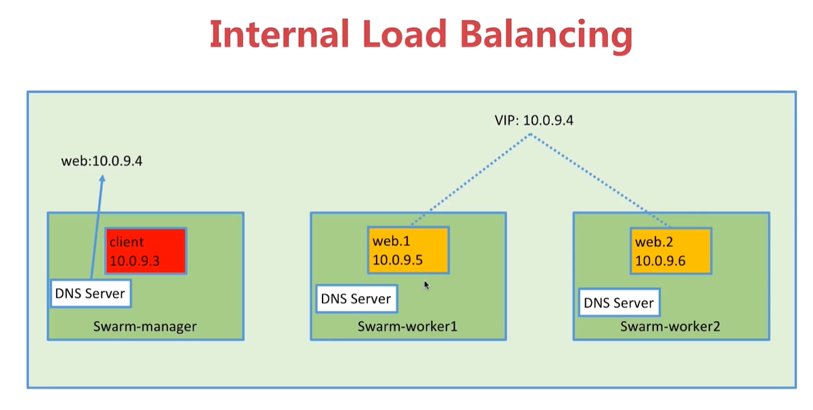
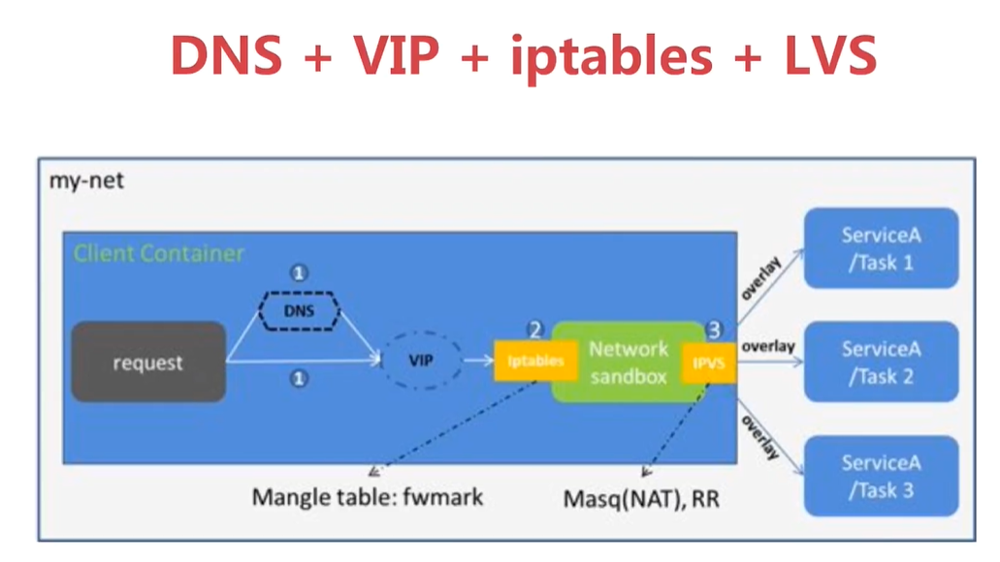
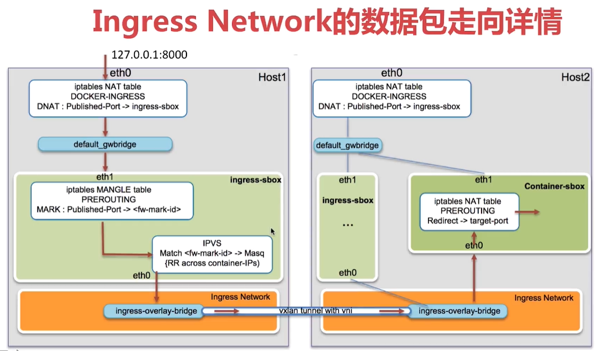

# 容器编排Docker Swarm

## 7.1 Docker Swarm介绍

### 使用容器的麻烦之处
+ 怎么去管理这么多容器
+ 怎么能方便的横向扩展
+ 如何去更新容器而不影响业务
+ 如何去调度追踪这些容器
+ 怎么去调度容器的创建
+ 保护隐私数据

### Swarm的原理图示
> 初学者接触容器编排学到的第一个工具

使用图示如下：

原理图示如下：

以redis部署3个节点为例：

Swarm服务创建与调度过程如下：


## 7.2 创建一个3节点的Swarm集群
> 三台机器的ip分别是192.168.100.116、192.168.100.117、192.168.100.116

### 创建manager节点
> 把192.168.100.116作为manager节点`docker swarm init --advertise-addr=192.168.100.116`
```powershell
[root@localhost ~]#  docker swarm init --advertise-addr=192.168.100.116
Swarm initialized: current node (6rjcjgv4a1znrfjughoow8hdy) is now a manager.

To add a worker to this swarm, run the following command:

    docker swarm join \
    --token SWMTKN-1-0ckgcq7w0bdtwrgwgwelun20p6v4127k3hp433jz89k8uemqfx-75e4xtannco7fu5khddjoh9kx \
    192.168.100.116:2377

To add a manager to this swarm, run 'docker swarm join-token manager' and follow the instructions.
```
### 把117和118加入到swarm集群成为worker节点
```powershell
[root@localhost ~]#   docker swarm join \
>     --token SWMTKN-1-0ckgcq7w0bdtwrgwgwelun20p6v4127k3hp433jz89k8uemqfx-75e4xtannco7fu5khddjoh9kx \
>     192.168.100.116:2377
This node joined a swarm as a worker.
```

### 在116上查看集群情况
```powershell
[root@localhost ~]# docker node ls
ID                           HOSTNAME  STATUS  AVAILABILITY  MANAGER STATUS
b1afoe8r6hff54s23sp1t9vt4    worker1   Ready   Active
el8xrk78q1149fqhukqt18pwr *  manager   Ready   Active        Leader
kd3k5oop5agp11z8pym3xapzs    worker2   Ready   Active
```

## 7.3 Service的创建维护和水平扩展
### 创建一个服务
> docker service create 创建一个service，类似于在本地执行docker run，但是在cluster环境下都用docker service create
```powershell
[root@localhost ~]# docker service create --name demo busybox sh -c "while true;do sleep 3600;done" // 创建服务，默认一个节点
g0xiw08mld3pcwxb5ivfsldms
[root@localhost ~]# docker ps // 查看创建的容器
CONTAINER ID        IMAGE                                                                             COMMAND                  CREATED             STATUS              PORTS               NAMES
595854511c20        busybox@sha256:6915be4043561d64e0ab0f8f098dc2ac48e077fe23f488ac24b665166898115a   "sh -c 'while true..."   31 seconds ago      Up 30 seconds                           demo.1.o1z63v61a55c1hx6jp6lh5l03
[root@localhost ~]# docker service ps demo // 查看创建的服务
ID            NAME    IMAGE           NODE     DESIRED STATE  CURRENT STATE           ERROR  PORTS
y56n5g6v56kw  demo.1  busybox:latest  manager  Running        Running 48 seconds ago
[root@localhost ~]# docker service ls // 列出所有的服务
ID            NAME  MODE        REPLICAS  IMAGE
g0xiw08mld3p  demo  replicated  1/1       busybox:latest
```

### 服务的扩展
```powershell
[root@localhost ~]# docker service ls
ID            NAME  MODE        REPLICAS  IMAGE
g0xiw08mld3p  demo  replicated  5/5       busybox:latest
[root@manager ~]# docker service scale demo=5 // 服务的容器数扩容到5个
demo scaled to 5
[root@manager ~]# docker service ps demo // 查看此时的服务信息
ID            NAME    IMAGE           NODE     DESIRED STATE  CURRENT STATE           ERROR  PORTS
y56n5g6v56kw  demo.1  busybox:latest  manager  Running        Running 2 minutes ago
l32x8zrwtegc  demo.2  busybox:latest  worker2  Running        Running 10 seconds ago
76j9agmfpg3h  demo.3  busybox:latest  manager  Running        Running 10 seconds ago
w3cn8o04naq9  demo.4  busybox:latest  worker1  Running        Running 10 seconds ago
y6b62xi6w84b  demo.5  busybox:latest  worker2  Running        Running 10 seconds ago
[root@manager ~]# docker service rm demo // 删除demo服务
demo
```

## 7.4 在swarm集群里通过service部署wordpress
### 1.创建overlay网络
```powershell
[root@manager ~]# docker network create -d overlay demo
2vjs0y1n2tqvuuiiohi3pe9tz
[root@manager ~]# docker ps
CONTAINER ID        IMAGE               COMMAND             CREATED             STATUS              PORTS               NAMES
[root@manager ~]# docker network ls
NETWORK ID          NAME                DRIVER              SCOPE
1167462d60b2        bridge              bridge              local
2vjs0y1n2tqv        demo                overlay             swarm
5a5b4db8db19        docker_gwbridge     bridge              local
c27645bea545        host                host                local
ltncyma2v0e7        ingress             overlay             swarm
cd3a13dd8dcb        mybridge            bridge              local
fcab1d25df11        none                null                local
```
### 2.启动mysql
```powershell
[root@manager ~]# docker service create --name mysql --env MYSQL_ROOT_PASSWORD=root --env MYSQL_DATABASE=wordpress --network demo --mount type=volume,source=mysql-data,destination=/var/lib/mysql mysql:5.7.15
3uvj3yhqmzcx2n9avva3yqz3h
[root@manager ~]# docker service ps mysql
ID            NAME     IMAGE         NODE     DESIRED STATE  CURRENT STATE             ERROR  PORTS
lfpvzp38jkdi  mysql.1  mysql:5.7.15  manager  Running        Running 11 seconds ago
```
### 3.启动wordpress
```powershell
[root@manager ~]# docker service create --name wordpress -p 80:80 --env WORDPRESS_DB_PASSWORD=root --env WORDPRESS_DB_HOST=mysql --network demo wordpress
yus2hr15jhpjcnjpealew8bqz
[root@manager ~]# docker service ps wordpress
ID            NAME         IMAGE             NODE     DESIRED STATE  CURRENT STATE            ERROR  PORTS
aksbn70gzpos  wordpress.1  wordpress:latest  worker1  Running        Preparing 9 seconds ago
```

### 访问work1的ip192.168.100.117，可以看到wordpress已经正式可用了


### 注意点
docker swarm在manager节点创建了overlay的network之后，另外的worker主机不会立即创建该网络，而是等到需要的时候才会创建。比如本例当worker1的Wordpress需要使用manager上的mysql时候，worker1就会自动创建该overlay网络了。之前第三方etcd所实现的功能就由docker swarm代替

## 7.5 Swarm集群服务间通信之Routing Mesh
### Swarm的DNS服务发现


### 时间VIP(Virtual IP虚拟IP)
```powershell
[root@manager ~]# docker network create -d overlay demo // 创建overlay网络
2vjs0y1n2tqvuuiiohi3pe9tz
[root@manager ~]# docker service create --name whoami -p 8000:8000 --network demo jwilder/whoami // 启动whoami服务，可以用ip:port来返回当前容器的主机名
ukkw2ogphxad43ua90xz9h0q6
[root@manager ~]# docker service ls // 查看服务是否启动起来了
ID            NAME    MODE        REPLICAS  IMAGE
ukkw2ogphxad  whoami  replicated  0/1       jwilder/whoami:latest
[root@manager ~]# docker service ps whoami // 查看whoami服务的详情,可以看到服务跑在manager节点上
ID            NAME      IMAGE                  NODE     DESIRED STATE  CURRENT STATE           ERROR  PORTS
zq6f6n5cfdp3  whoami.1  jwilder/whoami:latest  manager  Running        Running 32 seconds ago
[root@manager ~]# docker ps // 在manager节点上可以看到whoami的容器
CONTAINER ID        IMAGE                                                                                    COMMAND             CREATED             STATUS              PORTS               NAMES
0ac399e7a4e0        jwilder/whoami@sha256:c621c699e1becc851a27716df9773fa9a3f6bccb331e6702330057a688fd1d5a   "/app/http"         43 seconds ago      Up 43 seconds       8000/tcp            whoami.1.zq6f6n5cfdp3rlnhmprqtsy0e
[root@manager ~]# docker service ls
ID            NAME    MODE        REPLICAS  IMAGE
ukkw2ogphxad  whoami  replicated  1/1       jwilder/whoami:latest
[root@manager ~]# curl 127.0.0.1:8000 // 返回whoami所在的主机名，现在因为实在容器中，所以返回主机名
I'm 0ac399e7a4e0
```

启动另一个服务，在其中访问上面的whoami服务

```powershell
[root@manager ~]# docker service create --name client --network demo busybox sh -c "while true;do sleep 3600;done"
38r11mymhyl425j6l0cm8en07
[root@manager ~]# docker service ls
ID            NAME    MODE        REPLICAS  IMAGE
38r11mymhyl4  client  replicated  1/1       busybox:latest
ukkw2ogphxad  whoami  replicated  1/1       jwilder/whoami:latest
[root@manager ~]# docker service ps client // 从下面可以看到client服务是启动在worker1(192.168.100.117)上，所以下面从worker1上进入client的容器访问whoamo
ID            NAME      IMAGE           NODE     DESIRED STATE  CURRENT STATE           ERROR  PORTS
rgd9ok68wyz5  client.1  busybox:latest  worker1  Running        Running 22 seconds ago
```

在worker1(192.168.100.117)中访问whoami，10.0.0.2实际就是swarm生成VIP(虚拟IP地址)

```powershell
[root@worker1 ~]# docker ps
CONTAINER ID        IMAGE                                                                             COMMAND                  CREATED             STATUS              PORTS               NAMES
c5a7385a93e4        busybox@sha256:6915be4043561d64e0ab0f8f098dc2ac48e077fe23f488ac24b665166898115a   "sh -c 'while true..."   31 seconds ago      Up 30 seconds                           client.1.rgd9ok68wyz59bjl3tjawkj5j
[root@worker1 ~]# docker exec -it c5a7385a93e4 sh
/ # ping whoami
PING whoami (10.0.0.2): 56 data bytes
64 bytes from 10.0.0.2: seq=0 ttl=64 time=0.023 ms
64 bytes from 10.0.0.2: seq=1 ttl=64 time=0.035 ms
64 bytes from 10.0.0.2: seq=2 ttl=64 time=0.036 ms
^C
--- whoami ping statistics ---
3 packets transmitted, 3 packets received, 0% packet loss
round-trip min/avg/max = 0.023/0.031/0.036 ms
```

对whoami服务进行扩容
```powershell
[root@manager ~]# docker service scale whoami=2
whoami scaled to 2
[root@manager ~]# docker service ls
ID            NAME    MODE        REPLICAS  IMAGE
38r11mymhyl4  client  replicated  1/1       busybox:latest
ukkw2ogphxad  whoami  replicated  2/2       jwilder/whoami:latest
[root@manager ~]# docker service ls
ID            NAME    MODE        REPLICAS  IMAGE
38r11mymhyl4  client  replicated  1/1       busybox:latest
ukkw2ogphxad  whoami  replicated  2/2       jwilder/whoami:latest
[root@manager ~]# docker service ps whoami
ID            NAME      IMAGE                  NODE     DESIRED STATE  CURRENT STATE           ERROR  PORTS
zq6f6n5cfdp3  whoami.1  jwilder/whoami:latest  manager  Running        Running 20 minutes ago
62j37kn20s3m  whoami.2  jwilder/whoami:latest  worker2  Running        Running 17 seconds ago
```

再进入client服务的容器worker中ping服务whoami,发现虚拟ip仍然是10.0.0.2，其实这个虚拟ip是上面两个whoami容器的负载均衡，这也体现出了虚拟ip的作用，即屏蔽底层实际的ip，以服务为单位提供虚拟ip，这样用户就不用关系具体的机器了。可以通过nslookup命名查看whoami服务下的所有容器的ip(`nslookup whoami` 和 `nslookup task.whoami`)
```powershell
[root@worker1 ~]# docker ps
CONTAINER ID        IMAGE                                                                             COMMAND                  CREATED             STATUS              PORTS               NAMES
c5a7385a93e4        busybox@sha256:6915be4043561d64e0ab0f8f098dc2ac48e077fe23f488ac24b665166898115a   "sh -c 'while true..."   31 seconds ago      Up 30 seconds                           client.1.rgd9ok68wyz59bjl3tjawkj5j
[root@worker1 ~]# docker exec -it c5a7385a93e4 sh

/ # ping whoami
PING whoami (10.0.0.2): 56 data bytes
64 bytes from 10.0.0.2: seq=0 ttl=64 time=0.038 ms
64 bytes from 10.0.0.2: seq=1 ttl=64 time=0.036 ms
^C
--- whoami ping statistics ---
2 packets transmitted, 2 packets received, 0% packet loss
round-trip min/avg/max = 0.036/0.037/0.038 ms
/ # nslookup whoami
Server:         127.0.0.11
Address:        127.0.0.11:53

Non-authoritative answer:

/ # nslookup task.whoami
Server:         127.0.0.11
Address:        127.0.0.11:53

Non-authoritative answer:

*** Can't find task.whoami: No answer(这里命令异常。实际应该是服务下所有容器的实际ip)
```


Smarm的VIP已经做好了多容器服务的负载均衡,如下图，每次ping服务whoami都会轮训访问服务下的容器



### 总结：Swarm中的服务集群间通信之Routing Mesh(主要包含负载均衡和overlay跨主机通信)
+ Internal：容器和容器之间的访问通过overlay网络(虚拟IP即VIP(Vitrual IP))
  + 
+ Ingress：如果服务有绑定端口，则此服务可以通过任意swarm节点的相应接口访问
  + 
  + 

## 7.6 Routing Mesh之Ingress负载均衡
> Swarm跨主机通信通过overlay实现，跨Service通信通过VIP(虚拟IP)实现

Ingress Network的负载均衡作用

```powershell
[root@manager ~]# docker service scale whoami=2 // 缩容到2，使得一个机器上没whoami容器了，再看下在这个没whoami服务的及其上用本地端口访问whoami服务
whoami scaled to 2
[root@manager ~]# docker service ps whoami
ID            NAME      IMAGE                  NODE     DESIRED STATE  CURRENT STATE           ERROR  PORTS
62j37kn20s3m  whoami.2  jwilder/whoami:latest  worker2  Running        Running 34 minutes ago
md5ia3yp1n44  whoami.3  jwilder/whoami:latest  worker1  Running        Running 22 minutes ago
[root@manager ~]# docker service ps whoami // 可以看到manager节点上没有whoami节点了，但是在下面curl本地8000端口仍能访问到服务，这实际就是Ingress Network的负载均衡作用
ID            NAME      IMAGE                  NODE     DESIRED STATE  CURRENT STATE           ERROR  PORTS
62j37kn20s3m  whoami.2  jwilder/whoami:latest  worker2  Running        Running 34 minutes ago
md5ia3yp1n44  whoami.3  jwilder/whoami:latest  worker1  Running        Running 22 minutes ago
[root@manager ~]# docker ps
CONTAINER ID        IMAGE               COMMAND             CREATED             STATUS              PORTS               NAMES
[root@manager ~]# curl 127.0.0.1:8000  // 本机没有容器仍能访问服务
I'm b6b552571d02
[root@manager ~]# curl 127.0.0.1:8000  // 而且还能负载均衡实现容器的轮询
I'm 928c4a25aa6e
[root@manager ~]# curl 127.0.0.1:8000
I'm b6b552571d02
[root@manager ~]# curl 127.0.0.1:8000
I'm 928c4a25aa6e
```

### Ingress Network实现负载均衡的原理


## 7.6 Docker Stack部署wordpress
> Docker Compose命令只支持单机集群（只有1台服务器）, Docker Stack命令既支持单机集群又支持多机集群，后者可以看做前者的集群版本
> docker-compose的v3版本新增了deploy字段专门用于使用swarm(即Docker Stack)部署多机器应用

更多的docker-compose参数参考[docker-compose编排参数详解](https://www.cnblogs.com/wutao666/p/11332186.html)，当前目录页放了对应的PDF版本

```yaml
version: '3'

services:

  web:
    image: wordpress
    ports:
      - 8080:80
    environment:
      WORDPRESS_DB_HOST: mysql
      WORDPRESS_DB_PASSWORD: root
    networks:
      - my-network
    depends_on:
      - mysql
    deploy: # swarm的部署参数
      mode: replicated # global表示全局就一个容器;replicated表示支持水平扩展
      replicas: 3 # 服务水平扩展的实例个数
      restart_policy:
        condition: on-failure
        delay: 5s
        max_attempts: 3
      update_config:
        parallelism: 1
        delay: 10s

  mysql:
    image: mysql:5.7.15
    environment:
      MYSQL_ROOT_PASSWORD: root
      MYSQL_DATABASE: wordpress
    volumes:
      - mysql-data:/var/lib/mysql
    networks:
      - my-network
    deploy:
      mode: global # 这个服务就一个实例容器，即全局唯一
      placement:
        constraints: # 部署时的一些限制条件
          - node.role == manager # 只在manager节点上部署

volumes:
  mysql-data:

networks:
  my-network:
    driver: overlay
```