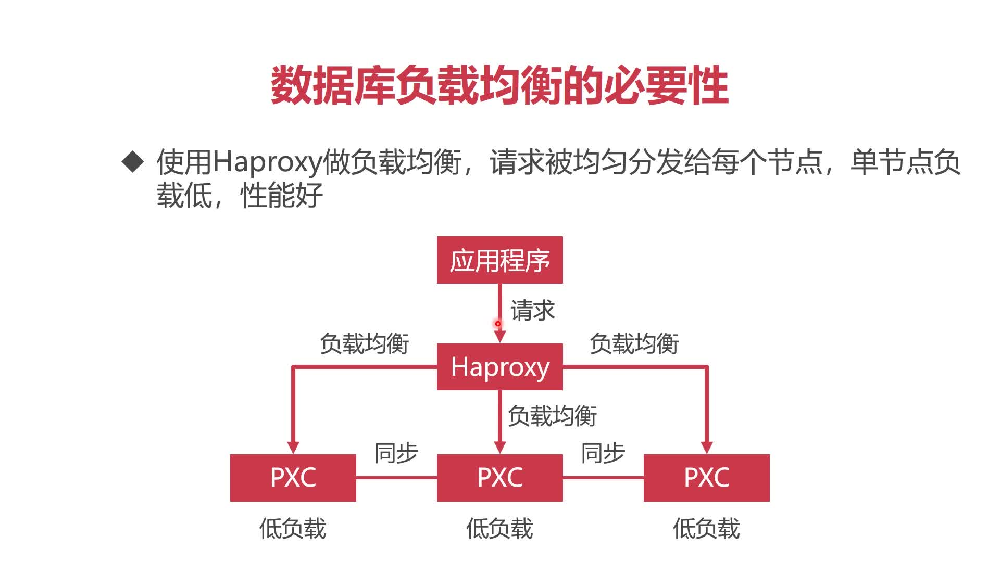

# 4-3_HAProxy实现数据库负载均衡

## HAProxy实现负载均衡的原理图



## 负载均衡中间件的对比

> 数据库多节点的同步用地协议是TCP/IP

+ 不用nginx的原因：刚刚支持TCP/IP协议，对于数据库同步支持不好
+ 不用Apache的原因:不支持TCP/IP协议
+ 不用LVS的原因：不支持在虚拟机里使用，不方便学习
+ 使用HAProxy的原因：对TCP/IP的支持好，有官方的Docker镜像，方便学习


## 使用HAProxy进行数据库的负载均衡

### 1.准备hasproxy的镜像

```shell
docker pull haproxy
```

### 2.自定义配置文件

`touch /usr1/l00379880/haproxy/haproxy.cfg`,配置文件的教程参考: https://zhangge.net/5125.html ，典型的配置文件内容如下：

```haproxy
global
	#工作目录
	chroot /usr/local/etc/haproxy
	#日志文件，使用rsyslog服务中local5日志设备（/var/log/local5），等级info
	log 127.0.0.1 local5 info
	#守护进程运行
	daemon

defaults
	log	global
	mode	http
	#日志格式
	option	httplog
	#日志中不记录负载均衡的心跳检测记录
	option	dontlognull
  #连接超时（毫秒）
	timeout connect 5000
  #客户端超时（毫秒）
	timeout client  50000
	#服务器超时（毫秒）
  timeout server  50000

#监控界面	
listen  admin_stats
	#监控界面的访问的IP和端口
	bind  0.0.0.0:8888
	#访问协议
  mode        http
	#URI相对地址
  stats uri   /dbs
	#统计报告格式
  stats realm     Global\ statistics
	#登陆帐户信息
  stats auth  admin:abc123456
#数据库负载均衡
listen  proxy-mysql
	#访问的IP和端口
	bind  0.0.0.0:3306  
  #网络协议
	mode  tcp
	#负载均衡算法（轮询算法）
	#轮询算法：roundrobin
	#权重算法：static-rr
	#最少连接算法：leastconn
	#请求源IP算法：source 
  balance  roundrobin
	#日志格式
  option  tcplog
	#在MySQL中创建一个没有权限的haproxy用户，密码为空。Haproxy使用这个账户对MySQL数据库心跳检测
  option  mysql-check user haproxy
  server  MySQL_1 172.18.0.2:3306 check weight 1 maxconn 2000  
  server  MySQL_2 172.18.0.3:3306 check weight 1 maxconn 2000  
	server  MySQL_3 172.18.0.4:3306 check weight 1 maxconn 2000 
	server  MySQL_4 172.18.0.5:3306 check weight 1 maxconn 2000
	server  MySQL_5 172.18.0.6:3306 check weight 1 maxconn 2000
	#使用keepalive检测死链
  option  tcpka  
```
