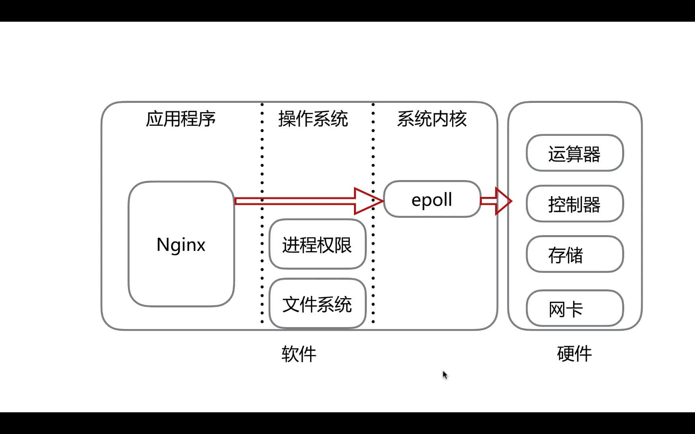
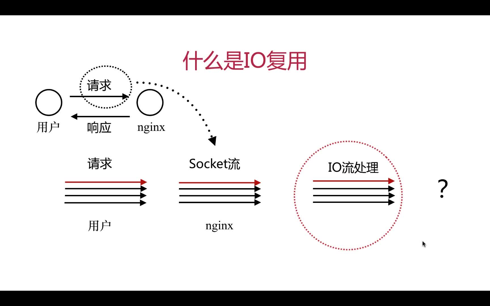
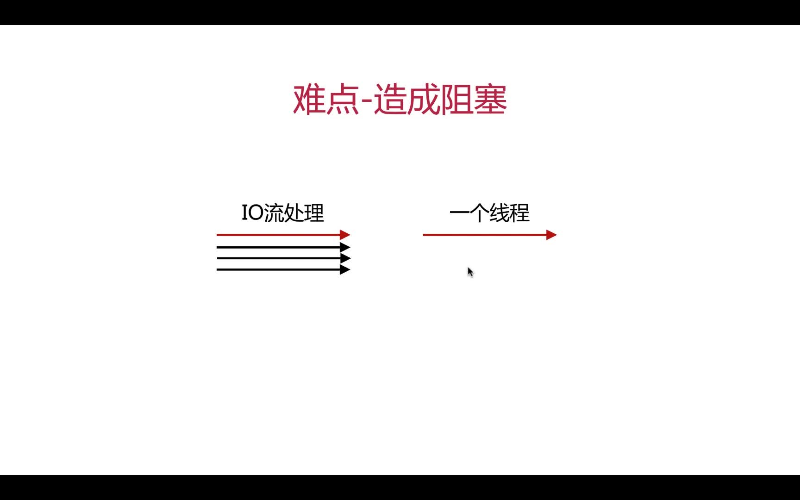
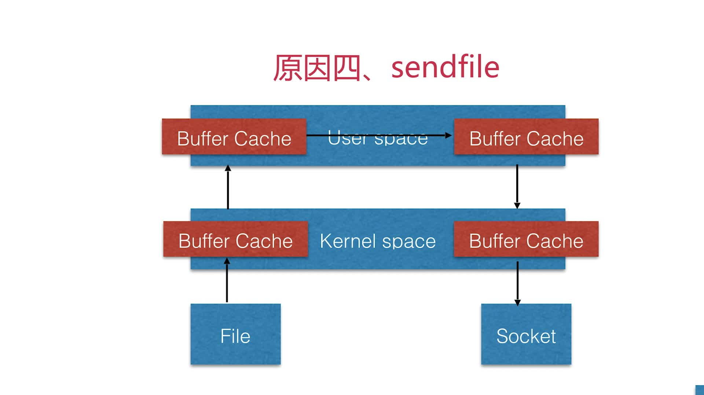

# 第2章 基础篇

## 2.1 什么是nginx

### 2.1.1 什么是中间件


### 2.1.2 Nginx概述

Nginx是一个开源且高性能、可靠的HTTP中间件、代理服务，支持海量并发请求的Web服务

## 2.2 常见的中间件服务

+ **httpd**:Apache基金会
+ **IIS**：微软
+ **gws**:google web server,谷歌,不对外开放
+ **nginx**: 俄罗斯F5，[介绍](https://baike.baidu.com/item/nginx/3817705?fr=aladdin),[官网](https://www.nginx.com/)

## 2.3 Nginx优势：多路IO复用

> 采用了IO多路复用epoll模型。下面阐述IO流处理的机制

+ epoll机制  
  
+ IO复用
  + IO流处理的场景
    
  + IO流处理的难点：造成阻塞
    
  + IO流处理的两种方式(多线程和多进程)的劣势
    
    > 一个线程只能处理一个流的IO事件。如果想要同时处理多个流，要么多进程(fork)，要么多线程(pthread_create)，但是这两种方法的效率都不高。所以最好交给**一个线程去采用多路IO复用模式**，下一节讲

## 2.4 Nginx使用epoll模型的优势介绍

### 2.4.1 实现IO流非阻塞模式

> 流阻塞的伪代码如下

```c
while true {
  for i in stream[] {
    if(i has data){
      read ultil unavaliable;
    }
  }
}
```

上面的代码中，如果所有的流都没有数据，那么只会白白浪费CPU。为了解决这么问题，Linux内核提供了下面的IO复用内核模式

### 2.4.2 IO复用内核模式种类

+ 类型一：select模型、poll模型

+ 类型二：epoll模型

发展历史是：`select--->poll--->epoll`

#### select模型

> 伪代码如下

```c
while true {
  select(streams[]){ // 通过select来选取streams中有数据的来进行操作，避免流中没有数据时浪费CPU
    for i in stream[] {
      if(i has data){
        read ultil unavaliable;
      }
    }
  }
}
```

**`select`和`epoll`其实都相当于一个代理**

### 2.4.3 epoll模型的优势

+ 解决了`select`模型对于文件句柄fd的打开限制
+ 采用callback函数回调机制优化模型效率
+ **CPU亲和**
  > **CPU亲和**：把CPU的核心和ngnix工作进程绑定，把每个worker进程固定在一个CPU上执行，减少切换CPU的cache miss，获得更好的性能,在nginx.conf中通过`work_process`来设置
  + cache 高速缓冲存储器
  + cache miss 容量缺失
  + 容量缺失：因cache容量限制而导致cache set个数限制
    > 如：一个程序要请求的3个数据在不同的set中，而cache只有两个set，这样必定会发生cache miss
  
+ sendfile: sendfile静态文件直接通过内核空间，不经过用户空间传输，提高传输效率。在nginx.conf中可通过`sendfile on;`来开启
  
  
## 2.7 nginx的安装

> 见[spring-boot-online-exam/backend/README.md#7配置nginx](https://github.com/19920625lsg/spring-boot-online-exam/blob/master/backend/README.md#7配置nginx)

[官网地址](http://nginx.org/en/download.html)，里面的版本分类如下：

+ Mainline version -开发版
+ Stable version -稳定版
+ Legacy version -历史版本

## 2-8_2-16 安装参数、配置文件、虚拟主机三种方式等

> 这部分可以见之前学过的[nginx快速入门课程](https://github.com/19920625lsg/docker-k8s-devops/blob/master/Nginx/Nginx快速入门/README.md)

## 2-17~2-18 Nginx日志_log_format

+ `error.log`:处理的是处理服务的错误状态，依赖于log_format配置
+ `access_log`:记录的是http请求的访问状态，依赖于log_format配置

log_format的默认值如下，里面用到的`$xxx`代表地是nginx的内置变量

```nginx
# 错误日志文件的位置和输出级别
log_format  main  '$remote_addr - $remote_user [$time_local] "$request" '
                  '$status $body_bytes_sent "$http_referer" '
                  '"$http_user_agent" "$http_x_forwarded_for"';
```

nginx默认log_format内容：

+ `remote_addr`:客户端地址
+ `remote_user`:http客户端请求认证的用户名，没有开启认证模块不会记录
+ `request`:request请求行
+ `status`:response返回的状态
+ `http_referer`: 上一级访问的url
+ `http_user_agent`: 客户端访问工具是什么,请求体里叫`User-Agent`，到这里要加个`http_`，然后小写、中划线改为下划线
+ `http_x_forwarded_for`: 记录每一级用户通过http请求携带的信息

更多Nginx日志和内置变量见

+ [官网Embeded Variables](http://nginx.org/en/docs/varindex.html)
+ [Nginx内置变量以及日志格式变量参数详解](https://www.cnblogs.com/wajika/p/6426270.html)

```nginx
$args                    #请求中的参数值
$query_string            #同 $args
$arg_NAME                #GET请求中NAME的值
$is_args                 #如果请求中有参数，值为"?"，否则为空字符串
$uri                     #请求中的当前URI(不带请求参数，参数位于$args)，可以不同于浏览器传递的$request_uri的值，它可以通过内部重定向，或者使用index指令进行修改，$uri不包含主机名，如"/foo/bar.html"。
$document_uri            #同 $uri
$document_root           #当前请求的文档根目录或别名
$host                    #优先级：HTTP请求行的主机名>"HOST"请求头字段>符合请求的服务器名.请求中的主机头字段，如果请求中的主机头不可用，则为服务器处理请求的服务器名称
$hostname                #主机名
$https                   #如果开启了SSL安全模式，值为"on"，否则为空字符串。
$binary_remote_addr      #客户端地址的二进制形式，固定长度为4个字节
$body_bytes_sent         #传输给客户端的字节数，响应头不计算在内；这个变量和Apache的mod_log_config模块中的"%B"参数保持兼容
$bytes_sent              #传输给客户端的字节数
$connection              #TCP连接的序列号
$connection_requests     #TCP连接当前的请求数量
$content_length          #"Content-Length" 请求头字段
$content_type            #"Content-Type" 请求头字段
$cookie_name             #cookie名称
$limit_rate              #用于设置响应的速度限制
$msec                    #当前的Unix时间戳
$nginx_version           #nginx版本
$pid                     #工作进程的PID
$pipe                    #如果请求来自管道通信，值为"p"，否则为"."
$proxy_protocol_addr     #获取代理访问服务器的客户端地址，如果是直接访问，该值为空字符串
$realpath_root           #当前请求的文档根目录或别名的真实路径，会将所有符号连接转换为真实路径
$remote_addr             #客户端地址
$remote_port             #客户端端口
$remote_user             #用于HTTP基础认证服务的用户名
$request                 #代表客户端的请求地址
$request_body            #客户端的请求主体：此变量可在location中使用，将请求主体通过proxy_pass，fastcgi_pass，uwsgi_pass和scgi_pass传递给下一级的代理服务器
$request_body_file       #将客户端请求主体保存在临时文件中。文件处理结束后，此文件需删除。如果需要之一开启此功能，需要设置client_body_in_file_only。如果将次文件传 递给后端的代理服务器，需要禁用request body，即设置proxy_pass_request_body off，fastcgi_pass_request_body off，uwsgi_pass_request_body off，or scgi_pass_request_body off
$request_completion      #如果请求成功，值为"OK"，如果请求未完成或者请求不是一个范围请求的最后一部分，则为空
$request_filename        #当前连接请求的文件路径，由root或alias指令与URI请求生成
$request_length          #请求的长度 (包括请求的地址，http请求头和请求主体)
$request_method          #HTTP请求方法，通常为"GET"或"POST"
$request_time            #处理客户端请求使用的时间,单位为秒，精度毫秒； 从读入客户端的第一个字节开始，直到把最后一个字符发送给客户端后进行日志写入为止。
$request_uri             #这个变量等于包含一些客户端请求参数的原始URI，它无法修改，请查看$uri更改或重写URI，不包含主机名，例如："/cnphp/test.php?arg=freemouse"
$scheme                  #请求使用的Web协议，"http" 或 "https"
$server_addr             #服务器端地址，需要注意的是：为了避免访问linux系统内核，应将ip地址提前设置在配置文件中
$server_name             #服务器名
$server_port             #服务器端口
$server_protocol         #服务器的HTTP版本，通常为 "HTTP/1.0" 或 "HTTP/1.1"
$status                  #HTTP响应代码
$time_iso8601            #服务器时间的ISO 8610格式
$time_local              #服务器时间（LOG Format 格式）
$cookie_NAME             #客户端请求Header头中的cookie变量，前缀"$cookie_"加上cookie名称的变量，该变量的值即为cookie名称的值
$http_NAME               #匹配任意请求头字段；变量名中的后半部分NAME可以替换成任意请求头字段，如在配置文件中需要获取http请求头："Accept-Language"，$http_accept_language即可
$http_cookie
$http_host               #请求地址，即浏览器中你输入的地址（IP或域名）
$http_referer            #url跳转来源,用来记录从那个页面链接访问过来的
$http_user_agent         #用户终端浏览器等信息
$http_x_forwarded_for
$sent_http_NAME          #可以设置任意http响应头字段；变量名中的后半部分NAME可以替换成任意响应头字段，如需要设置响应头Content-length，$sent_http_content_length即可
$sent_http_cache_control
$sent_http_connection
$sent_http_content_type
$sent_http_keep_alive
$sent_http_last_modified
$sent_http_location
$sent_http_transfer_encoding
```

## 2-19~2-23 Nginx模块讲解
