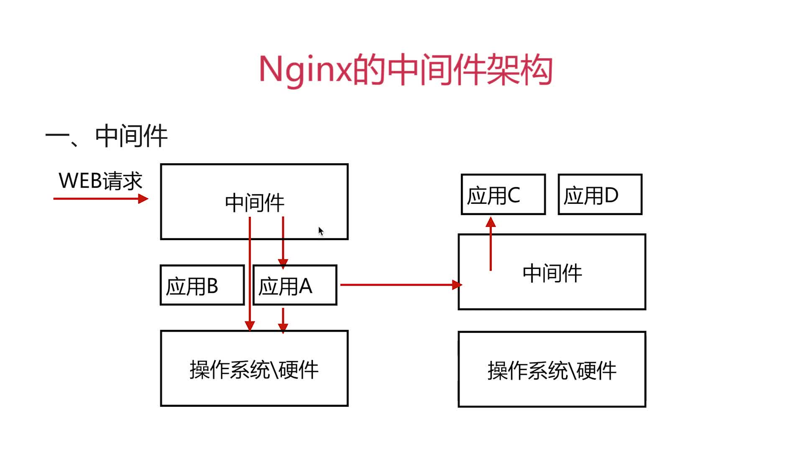

# 第2章 基础篇

## 2.1 什么是nginx

### 2.1.1 什么是中间件



### 2.1.2 Nginx概述

Nginx是一个开源且高性能、可靠的HTTP中间件、代理服务，支持海量并发请求的Web服务

## 2.2 常见的中间件服务

+ **httpd**:Apache基金会
+ **IIS**：微软
+ **gws**:google web server,谷歌,不对外开放
+ **nginx**: 俄罗斯F5，[介绍](https://baike.baidu.com/item/nginx/3817705?fr=aladdin),[官网](https://www.nginx.com/)

## 2.3 Nginx优势：多路IO复用

> 采用了IO多路复用epoll模型。下面阐述IO流处理的机制

+ epoll机制  
  
+ IO复用
  + IO流处理的场景
    
  + IO流处理的难点：造成阻塞
    
  + IO流处理的两种方式(多线程和多进程)的劣势
    
    > 一个县城只能处理一个流的IO时间。如果想要同事处理多个流，要么多进程(fork)，要么多线程(pthread_create)，但是这两种方法的效率都不高。所以最好交给**一个线程去采用多路IO复用模式**，下一节讲

## 2.4 Nginx使用epoll模型的优势介绍

### 2.4.1 实现IO流非阻塞模式

> 流阻塞的伪代码如下

```c
while true {
  for i in stream[] {
    if(i has data){
      read ultil unavaliable;
    }
  }
}
```

上面的代码中，如果所有的流都没有数据，那么只会白白浪费CPU。为了解决这么问题，Linux内核提供了下面的IO复用内核模式

### 2.4.2 IO复用内核模式种类

+ 类型一：select模型、poll模型

+ 类型二：epoll模型

发展历史是：`select--->poll--->epoll`

#### select模型

> 伪代码如下

```c
while true {
  select(streams[]){ // 通过select来选取streams中有数据的来进行操作，避免流中没有数据时浪费CPU
    for i in stream[] {
      if(i has data){
        read ultil unavaliable;
      }
    }
  }
}
```

**`select`和`epoll`其实都相当于一个代理**

### 2.4.3 epoll模型的优势

+ 解决了`select`模型对于文件句柄fd的打开限制
+ 采用callback函数回调机制优化模型效率
+ **CPU亲和**
  > **CPU亲和**：把CPU的核心和ngnix工作进程绑定，把每个worker进程固定在一个CPU上执行，减少切换CPU的cache miss，获得更好的性能,在nginx.conf中通过`work_process`来设置
  + cache 高速缓冲存储器
  + cache miss 容量缺失
  + 容量缺失：因cache容量限制而导致cache set个数限制
    > 如：一个程序要请求的3个数据在不同的set中，而cache只有两个set，这样必定会发生cache miss
  
+ sendfile: sendfile静态文件直接通过内核空间，不经过用户空间传输，提高传输效率。在nginx.conf中可通过`sendfile on;`来开启
  
  
## 2.7 nginx的安装

> 见[spring-boot-online-exam/backend/README.md#7配置nginx](https://github.com/19920625lsg/spring-boot-online-exam/blob/master/backend/README.md#7配置nginx)

[官网地址](http://nginx.org/en/download.html)，里面的版本分类如下：
+ Mainline version -开发版
+ Stable version -稳定版
+ Legacy version -历史版本
