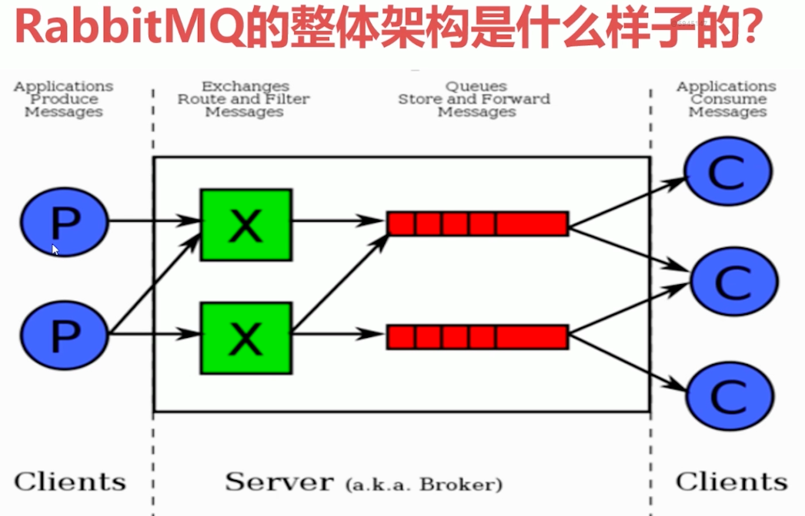
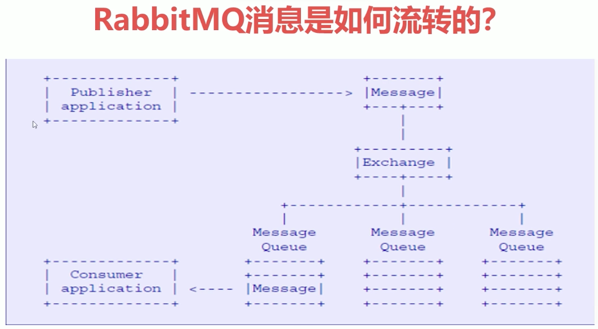
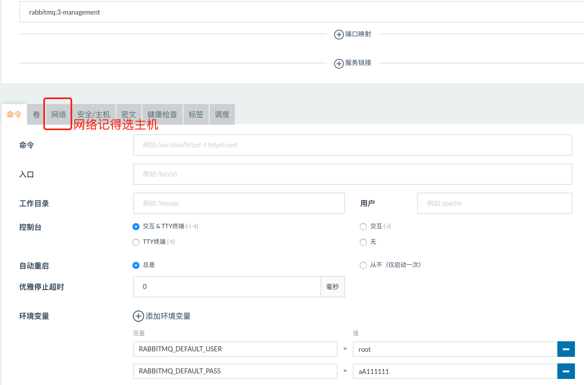

# RabbitMQ精讲

> 参考教程 [RabbitMQ教程](https://blog.csdn.net/hellozpc/article/details/81436980)

## 1.概述
RabbitMQ是一个开源的消息代理和队列服务器，用来通过普通协议在完全不同的应用之间共享数据，RabbitMQ是使用Erlang语言来编写地，并且RabbitMQ是基于AMQP协议的

## 2.优点

+ 开源、性能优秀，稳定性有保障
+ 提供可靠性消息投递模式(Confirm)、返回模式(return)
+ 与SpringAMQP完美整合，API丰富
+ 集群模式丰富，表达式配置，HA模式(HAProxy高可用模式)，镜像队列模型
+ 保证数据不丢失的前提下做到高可靠性、可用性

## 3.RabbitMQ高性能的原因

+ Erlang语言最初在于交换机领域的架构模式，这样使得RabbitMQ在Broker之间进行数据交互的性能是非常优秀的
+ Erlang:Erlang有着和原生Docket一样的延迟

## 4.什么是AMQP

+ 全称：Advanced Message Queuing Protocol 高级消息队列协议
+ 定义：是具有现代特征的二进制协议。是一个提供统一消息服务的应用层标准的高级消息队列协议，是应用层协议的一个开放标准，为面向消息的中间件设计

## 5.AMQP核心概念

+ Server:又称Broker，接受客户端连接，实现AMQP实体服务
+ Connection:连接，应用程序与Broker的网络连接
+ Channel:网络信道，几乎所有的操作都在Channel中进行，Channel是进行消息读写的通道，客户端可以建立多个Channel，每个Channel代表一个会话任务
+ Message:消息，服务器和应用程序之间传送的数据，由Properties和Body组成。Properties可以对消息进行修饰，比如消息的优先级、延迟等高级特性；Body则就是消息体内容
+ Virtual host:虚拟地址，用于进行逻辑隔离，最上层的消息路由。一个Virtual Host里面可以有若干个Exchange和Queue，同一个Virtual Host里面不能有相同名称的Exchange或Queue
+ Exchange:交换机，接收消息，根据路由键转发消息到绑定的队列
+ Binding:Exchange和Queue之间的虚拟连接，binding中可以包含routing key
+ Routing key:一个路由规则，虚拟机可用它来确定如何路由一个特定消息
+ Queue:也称为Message Queue，消息队列，保存消息并将他们转发给消费者

## 6.RabbitMQ的整体架构

## 7.RabbitMQ的消息流转示意图

## 8.RabbitMQ的安装(使用Docker)

> docker run -d --hostname my-rabbit --name some-rabbit -p 15672:15672 -p 5672:5672 -p 25672:25672 -e RABBITMQ_DEFAULT_USER=root -e RABBITMQ_DEFAULT_PASS=aA111111 rabbitmq:3-management

+ `-e RABBITMQ_DEFAULT_USER=root`:指定用户名
+ `-e RABBITMQ_DEFAULT_PASS=aA111111`:指定密码

在rancher中的启动方式如下：

然后通过 http://ip:9527/#/ 即可访问RabbitMQ，用上面的**root-aA111111**即可访问RabbitMQ的Web界面.当不指定用户名和密码时，默认是**guest-guest**

web界面的功能介绍可见：[RabbitMQ管理界面](https://www.cnblogs.com/java-zhao/p/5670453.html)

## 9.RabbitMQ的命令行与管控台基础操作

> 可以直接在rancher中容器操作的'执行命令行'选项来执行下面的命令

### 9.1 命令行

+ rabbitmqctl stop_app：关闭应用
+ rabbitmqctl start_app:启动应用
+ rabbitmqctl status:节点状态
+ 