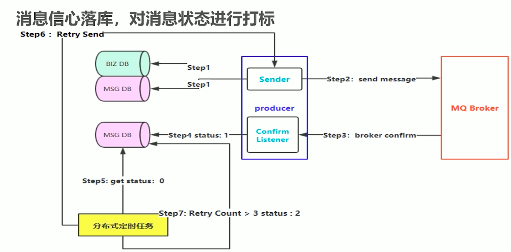
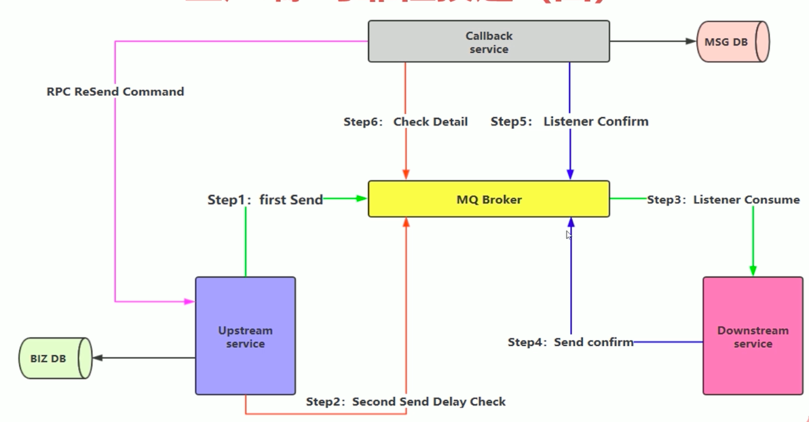
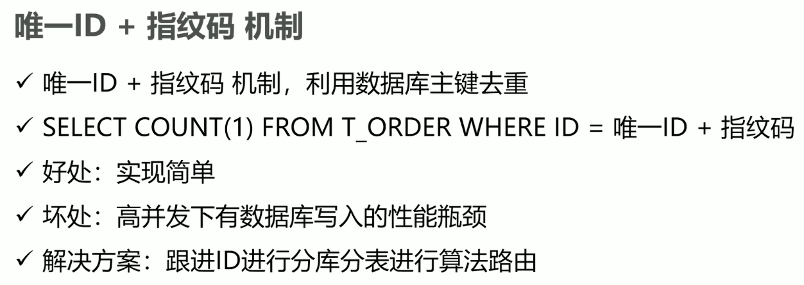
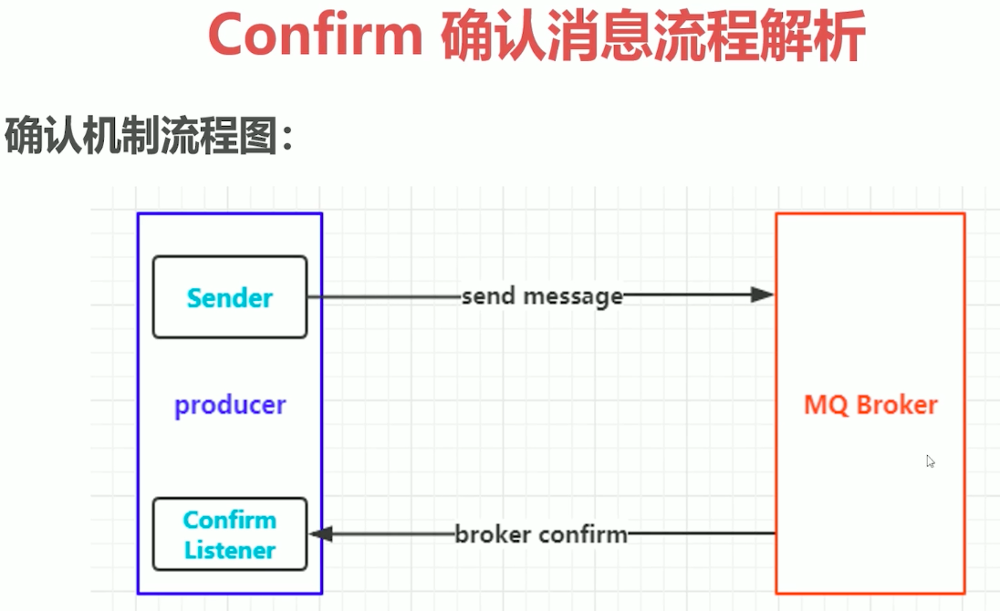
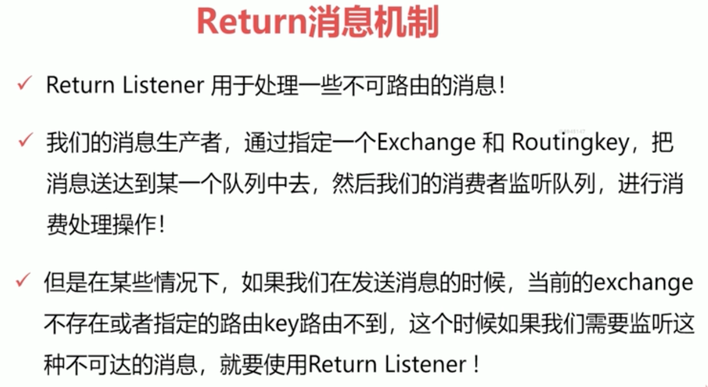
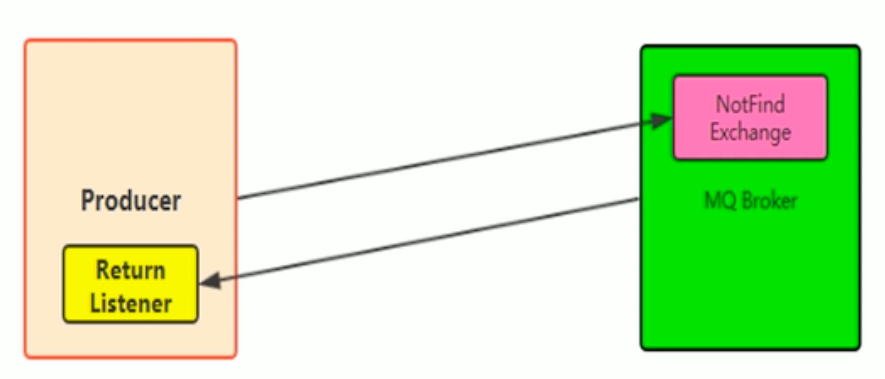
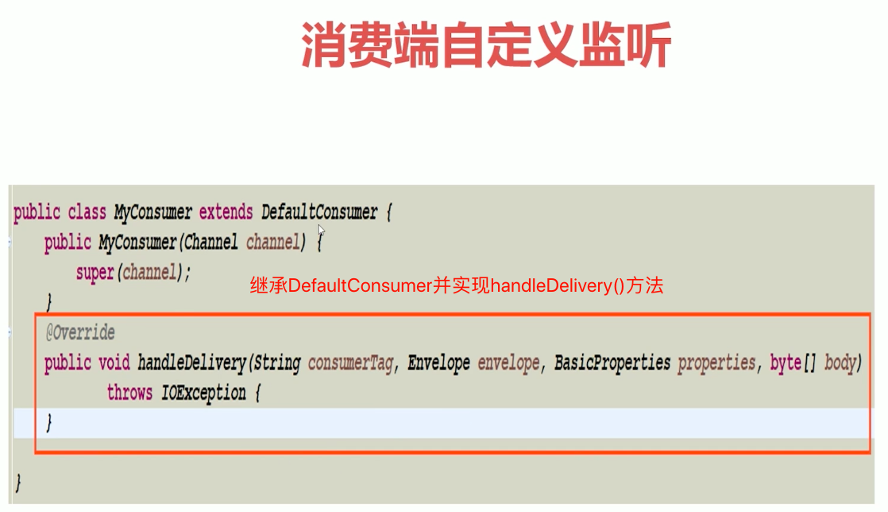
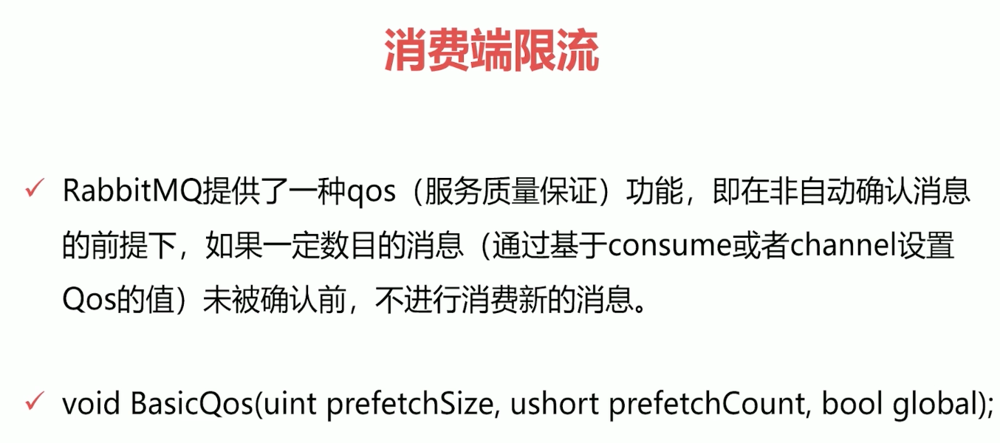
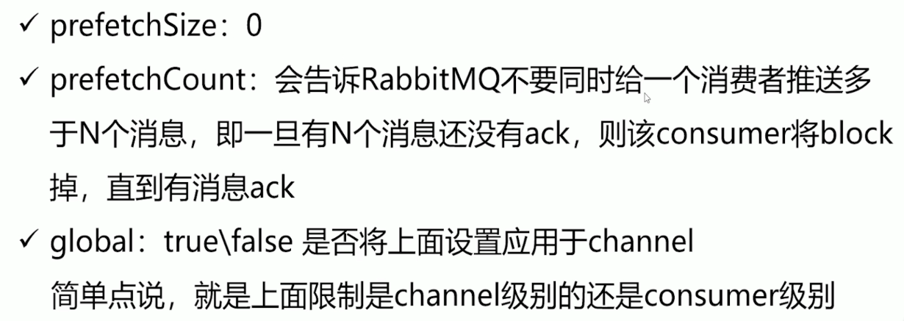

# 第3章 RabbitMQ高级特性

本章重点

+ 自定义消费者
+ 消息的ACK与重回队列
+ 消息的限流
+ TTL消息
+ 死信队列

## 3.1 消息如何保障100%的投递成功？

### 3.1.1 什么是生产端的可靠性投递

+ 保障消息的成功发出
+ 保障MQ节点的成功接收
+ 发送端收到MQ节点(Broker)确认应答
+ 完善的消息进行补偿机制

### 3.1.2 BAT/TMD互联网大厂的解决方案

+ 消息落库，对消息状态进行打标
  
+ 消息的延迟投递，做二次确认，回调检查，减少数据库操作
  

## 3.2 幂等性

> 消费端实现幂等性，就意味着，我们的消息永远不会被消费多次，即使我们收到了多条一样的消息

业界主流的幂等性操作如下

+ 唯一ID+指纹码机制，利用数据库主键去重
  
+ 利用Redis的原子性去实现幂等性
  

## 3.3 Confirm确认消息

### 3.3.1 Confirm消息确认机制的理解

+ 消息的确认，是指生产者投递消息后，如果Broker收到消息，则会给生产者一个应答
+ 生产者进行接收应答，用来确认这条消息是否正常地发送到Broker，这种方式也是消息的可靠性投递的核心保障

 

### 3.3.2 Confirm消息机制的实现

代码流程图如下：

代码示例见 [Confirm消息机制的实现](code/rabbitmqdemo/src/main/java/com/huawei/l00379880/rabbitmqdemo/confirm)

## 3.4 Return消息机制

> 把不可达的消息返回给发送端

代码示例见 [Return消息机制代码范例](code/rabbitmqdemo/src/main/java/com/huawei/l00379880/rabbitmqdemo/returnlistener)

## 3.5 消费端的自定义监听

> 实现Consumer或者继承DefaultConsumer就可以代码原来麻烦的for循环；额

代码示例见 [此定义消费者Consumer代码范例](code/rabbitmqdemo/src/main/java/com/huawei/l00379880/rabbitmqdemo/consumer)

## 3.6 消息的限流

